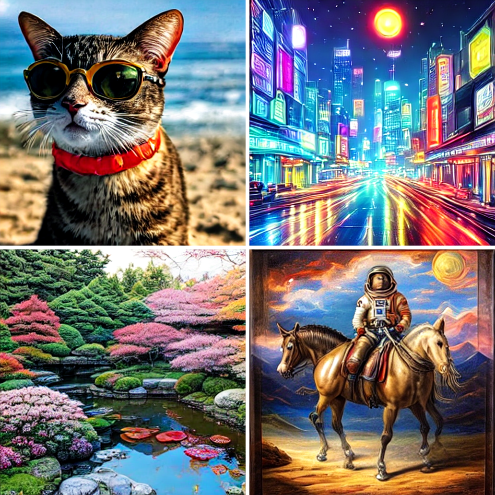

# CoreML-Models
Converted Core ML Model Zoo.


Core ML is a machine learning framework by Apple.
If you are iOS developer, you can easly use machine learning models in your Xcode project. 

# How to use

Take a look this model zoo, and if you found the CoreML model you want,
download the model from google drive link and bundle it in your project.
Or if the model have sample project link, try it and see how to use the model in the project.
You are free to do or not.

**If you like this repository, please give me a star so I can do my best.**

# Section Link

- [**Image Classifier**](#image-classifier)
  - [Efficientnetb0](#efficientnetb0)
  - [Efficientnetv2](#efficientnetv2)
  - [VisionTransformer](#visiontransformer)
  - [Conformer](#conformer)
  - [DeiT](#deit)
  - [RepVGG](#repvgg)
  - [RegNet](#regnet)
  - [MobileViTv2](#mobilevitv2)

  
- [**Object Detection**](#object-detection)
  - [D-FINE](#d-fine)
  - [RF-DETR](#rf-detr)
  - [YOLOv5s](#yolov5s)
  - [YOLOv7](#yolov7)
  - [YOLOv8](#yolov8)
  - [YOLOv9](#yolov9)
  - [YOLOv10](#yolov10)
  - [YOLO11](#yolo11)
  - [YOLO26](#yolo26)
  - [YOLO-World](#yolo-world)

- [**Segmentation**](#segmentation)
  - [U2Net](#u2net)
  - [IS-Net](#is-net)
  - [RMBG1.4](#rmbg14)
  - [face-parsing](#face-parsing)
  - [Segformer](#segformer)
  - [BiseNetv2](#bisenetv2)
  - [DNL](#dnl)
  - [ISANet](#isanet)
  - [FastFCN](#fastfcn)
  - [GCNet](#gcnet)
  - [DANet](#danet)
  - [Semantic FPN](#semantic-fpn)
  - [cloths_segmentation](#cloths_segmentation)
  - [easyportrait](#easyportrait)
  - [MobileSAM](#mobilesam)
  - [SAM2-Tiny](#sam2-tiny)

- [**Video Matting**](#video-matting)
  - [MatAnyone](#matanyone)

- [**Super Resolution**](#super-resolution)
  - [Real ESRGAN](#real-esrgan)
  - [GFPGAN](#gfpgan)
  - [BSRGAN](#bsrgan)
  - [A-ESRGAN](#a-esrgan)
  - [Beby-GAN](#beby-gan)
  - [RRDN](#rrdn)
  - [Fast-SRGAN](#fast-srgan)
  - [ESRGAN](#esrgan)
  - [UltraSharp](#ultrasharp)
  - [SRGAN](#srgan)
  - [SRResNet](#srresnet)
  - [LESRCNN](#lesrcnn)
  - [MMRealSR](#mmrealsr)
  - [DASR](#dasr)
  - [SinSR](#sinsr)
      
- [**Low Light Enhancement**](#low-light-enhancement)
  - [StableLLVE](#stablellve)
  - [Zero-DCE](#zero-dce)
  - [Retinexformer](#retinexformer)

- [**Image Restoration**](#image-restroration)
  - [MPRNet](#mprnet)
  - [MIRNetv2](#mirnetv2)
  
- [**Image Generation**](#image-generation)
  - [MobileStyleGAN](#mobilestylegan)
  - [DCGAN](#dcgan)

- [**Image2Image**](#image2image)
  - [Anime2Sketch](#anime2sketch)
  - [AnimeGAN2Face_Paint_512_v2](#animegan2face_paint_512_v2)
  - [Photo2Cartoon](#photo2cartoon)
  - [AnimeGANv2_Hayao](#animeGANv2_hayao)
  - [AnimeGANv2_Paprika](#animeGANv2_paprika)
  - [WarpGAN Caricature](#warpgancaricature)
  - [UGATIT_selfie2anime](#ugatit_selfie2anime)
  - [Fast-Neural-Style-Transfer](#fast-neural-style-transfer)
  - [White_box_Cartoonization](#white_box_cartoonization)
  - [FacialCartoonization](#facialcartoonization)

- [**Inpainting**](#inpainting)
  - [AOT-GAN-for-Inpainting](#aot-gan-for-inpainting)
  - [Lama](#lama)

- [**Monocular Depth Estimation**](#monocular-depth-estimation)
  - [MiDaS](#midas)
  
- [**Stable Diffusion**](#stable-diffusion) **:text2image**
  - [Hyper-SD](#hyper-sd)
  - [stable-diffusion-v1-5](#stable-diffusion-v1-5)
  - [pastel-mix](#pastel-mix)
  - [Orange Mix](#orange-mix)
  - [Counterfeit-V2.5](#counterfeit)
  - [anything-v4.5](#anything-v4)
  - [Openjourney](#openjourney)
  - [dreamlike-photoreal-2.0](#dreamlike-photoreal-2)

- [**Image Colorization**](#image-colorization)
  - [DDColor Tiny](#ddcolor-tiny)

- [**Face Recognition**](#face-recognition)
  - [AdaFace IR-18](#adaface-ir-18)

- [**3D Face Pose Estimation**](#3d-face-pose-estimation)
  - [3DDFA_V2](#3ddfa_v2)

- [**Speaker Diarization**](#speaker-diarization)
  - [pyannote segmentation-3.0](#pyannote-segmentation-30)

- [**Voice Conversion**](#voice-conversion)
  - [OpenVoice V2](#openvoice-v2)

- [**Text-to-Speech**](#text-to-speech)
  - [Kokoro-82M](#kokoro-82m)

- [**Text-to-Music Generation**](#text-to-music-generation)
  - [Stable Audio Open Small](#stable-audio-open-small)

- [**Audio Source Separation**](#audio-source-separation)
  - [HTDemucs](#htdemucs)

- [**Vision-Language**](#vision-language)
  - [Florence-2-base](#florence-2-base)

- [**Zero-Shot Image Classification**](#zero-shot-image-classification)
  - [SigLIP ViT-B/16](#siglip-vit-b16)

# How to get the model
You can get the model converted to CoreML format from the link of Google drive.
See the section below for how to use it in Xcode.
The license for each model conforms to the license for the original project.

# Image Classifier

### Efficientnet


| Google Drive Link | Size | Dataset |Original Project | License |
| ------------- | ------------- | ------------- |------------- |------------- |
| [Efficientnetb0](https://drive.google.com/file/d/1mJq8SMuDaCQHW77ui3fAfe5o3Qu2GKMi/view?usp=sharing) | 22.7 MB | ImageNet | [TensorFlowHub](https://tfhub.dev/tensorflow/efficientnet/b0/classification/1)  |[Apache2.0](https://opensource.org/licenses/Apache-2.0)|


### Efficientnetv2


| Google Drive Link | Size | Dataset |Original Project | License | Year|
| ------------- | ------------- | ------------- |------------- |------------- |------------- |
| [Efficientnetv2](https://drive.google.com/file/d/12JiGwXh8pX3yjoG_GsJOKAnPd3lbVrrn/view?usp=sharing) | 85.8 MB | ImageNet | [Google/autoML](https://github.com/google/automl/tree/master/efficientnetv2)  | [Apache2.0](https://github.com/google/automl/blob/master/LICENSE)|2021|

### VisionTransformer

An Image is Worth 16x16 Words: Transformers for Image Recognition at Scale.


| Google Drive Link | Size | Dataset |Original Project | License |Year|
| ------------- | ------------- | ------------- |------------- |------------- |------------- |
| [VisionTransformer-B16](https://drive.google.com/file/d/1VPo8Cjv7dyicM4lcJ6TgxnD4AN3ldMQp/view?usp=sharing) | 347.5 MB | ImageNet | [google-research/vision_transformer](https://github.com/google-research/vision_transformer)  | [Apache2.0](https://github.com/google-research/vision_transformer/blob/main/LICENSE)|2021|

### Conformer

Local Features Coupling Global Representations for Visual Recognition.


| Google Drive Link | Size | Dataset |Original Project | License |Year|
| ------------- | ------------- | ------------- |------------- |------------- |------------- |
| [Conformer-tiny-p16](https://drive.google.com/file/d/1-4qVbuTYr4r4o08656iGtV8KKblAVVyr/view?usp=sharing) | 94.1 MB | ImageNet | [pengzhiliang/Conformer](https://github.com/pengzhiliang/Conformer)  | [Apache2.0](https://github.com/google-research/vision_transformer/blob/main/LICENSE)|2021|

### DeiT

Data-efficient Image Transformers


| Google Drive Link | Size | Dataset |Original Project | License |Year|
| ------------- | ------------- | ------------- |------------- |------------- |------------- |
| [DeiT-base384](https://drive.google.com/file/d/1-7J-b0fTjmZi2VDPrDCWKBsCYGxYP5yW/view?usp=sharing) | 350.5 MB | ImageNet | [facebookresearch/deit](https://github.com/facebookresearch/deit)  | [Apache2.0](https://github.com/facebookresearch/deit/blob/main/LICENSE)|2021|

### RepVGG

Making VGG-style ConvNets Great Again


| Google Drive Link | Size | Dataset |Original Project | License |Year|
| ------------- | ------------- | ------------- |------------- |------------- |------------- |
| [RepVGG-A0](https://drive.google.com/file/d/1i8mDvRGn2_OjzIG9ioVJyQrefVliKsh_/view?usp=sharing) | 33.3 MB | ImageNet | [DingXiaoH/RepVGG](https://github.com/DingXiaoH/RepVGG)  | [MIT](https://github.com/DingXiaoH/RepVGG/blob/main/LICENSE)|2021|

### RegNet

Designing Network Design Spaces


| Google Drive Link | Size | Dataset |Original Project | License |Year|
| ------------- | ------------- | ------------- |------------- |------------- |------------- |
| [regnet_y_400mf](https://drive.google.com/file/d/16jbUJ4gHSzdxxbYb99rOQe0FiKCuLyDB/view?usp=sharing) | 16.5 MB | ImageNet | [TORCHVISION.MODELS](https://pytorch.org/vision/stable/models.html#torchvision-models)  | [MIT](https://github.com/facebookresearch/pycls/blob/main/LICENSE)|2020|


### MobileViTv2

CVNets: A library for training computer vision networks


| Google Drive Link | Size | Dataset |Original Project | License |Year|Conversion Script|
| ------------- | ------------- | ------------- |------------- |------------- |------------- |------------- |
| [MobileViTv2](https://drive.google.com/file/d/1__aG67p6o5-NIchkHpfFJBszCpIhI0uf/view?usp=share_link) | 18.8 MB | ImageNet | [apple/ml-cvnets](https://github.com/apple/ml-cvnets)  | [apple](https://github.com/apple/ml-cvnets/blob/main/LICENSE)|2022|[]([https://colab.research.google.com/drive/1QiTlFsN948Xt2e4WgqUB8DnGgwWwtVZS?usp=sharing](https://colab.research.google.com/drive/1UQwhFpVP_4Q9I6LXPdBSS0VDhIRdUBQA?usp=sharing)) |

# Object Detection

### D-FINE


| Download Link | Size | Output | Original Project | License | Note | Sample Project |
| ------------- | ------------- | ------------- | ------------- |------------- |------------- |------------- |
|[dfine-n-coco](https://github.com/john-rocky/peaceofcake/releases/download/v0.2.0/dfine_n_coco.mlpackage.zip)|13MB| Confidence(MultiArray (Float32 300 × 80)), Coordinates (MultiArray (Float32 300 × 4)) |[Peterande/D-FINE](https://github.com/Peterande/D-FINE)|[Apache 2.0](https://github.com/Peterande/D-FINE/blob/master/LICENSE)|Input 640×640. Coordinates are normalized cxcywh. No NMS — filter by confidence threshold.| [peaceofcake DFINEDemo](https://github.com/john-rocky/peaceofcake/tree/main/DFINEDemo) |

### RF-DETR


| Download Link | Size | Output | Original Project | License | Note | Sample Project |
| ------------- | ------------- | ------------- | ------------- |------------- |------------- |------------- |
|[rfdetr-n-coco](https://github.com/john-rocky/peaceofcake/releases/download/v0.2.0/rfdetr_n_coco.mlpackage.zip)|95MB| Confidence(MultiArray (Float32 300 × 91)), Coordinates (MultiArray (Float32 300 × 4)) |[roboflow/rf-detr](https://github.com/roboflow/rf-detr)|[Apache 2.0](https://github.com/roboflow/rf-detr/blob/main/LICENSE)|Input 384×384. 91 classes (index 0 = background, 1-90 = COCO category IDs). Coordinates are normalized cxcywh. No NMS.| [peaceofcake DFINEDemo](https://github.com/john-rocky/peaceofcake/tree/main/DFINEDemo) |

### YOLOv5s


| Google Drive Link | Size | Output | Original Project | License | Note | Sample Project |
| ------------- | ------------- | ------------- | ------------- |------------- |------------- |------------- |
|[YOLOv5s](https://drive.google.com/file/d/1KT-9eKO4F-LYIJVYJg7dy2LEW_hVUq0M/view?usp=sharing)|29.3MB| Confidence(MultiArray (Double 0 × 80)), Coordinates (MultiArray (Double 0 × 4)) |[ultralytics/yolov5](https://github.com/ultralytics/yolov5)|[GNU](https://github.com/ultralytics/yolov5/blob/master/LICENSE)|Non Maximum Suppression has been added.| [CoreML-YOLOv5](https://github.com/john-rocky/CoreML-YOLOv5) |

### YOLOv7


| Google Drive Link | Size | Output | Original Project | License | Note | Sample Project | Conversion Script |
| ------------- | ------------- | ------------- | ------------- |------------- |------------- |------------- |------------- |
|[YOLOv7](https://drive.google.com/file/d/1EKBC7tiwP1tDvXUm_ldD1Nq7hW8HofLe/view?usp=sharing)|147.9MB| Confidence(MultiArray (Double 0 × 80)), Coordinates (MultiArray (Double 0 × 4)) |[WongKinYiu/yolov7](https://github.com/WongKinYiu/yolov7)|[GNU](https://github.com/WongKinYiu/yolov7/blob/main/LICENSE.md)|Non Maximum Suppression has been added.| [CoreML-YOLOv5](https://github.com/john-rocky/CoreML-YOLOv5) | [](https://colab.research.google.com/drive/1QiTlFsN948Xt2e4WgqUB8DnGgwWwtVZS?usp=sharing) |

### YOLOv8


| Google Drive Link | Size | Output | Original Project | License | Note | Sample Project | 
| ------------- | ------------- | ------------- | ------------- |------------- |------------- |------------- |
|[YOLOv8s](https://drive.google.com/file/d/1pLRh1Y37KLEMpQn3v8qH-A12swakoHbI/view?usp=share_link)|45.1MB| Confidence(MultiArray (Double 0 × 80)), Coordinates (MultiArray (Double 0 × 4)) |[ultralytics/ultralytics](https://github.com/ultralytics/ultralytics)|[GNU](https://github.com/ultralytics/ultralytics/blob/main/LICENSE)|Non Maximum Suppression has been added.| [CoreML-YOLOv5](https://github.com/john-rocky/CoreML-YOLOv5) |

### YOLOv9

YOLOv9: Learning What You Want to Learn Using Programmable Gradient Information. Uses PGI and GELAN architecture for efficient object detection.

| Download Link | Size | Output | Original Project | License | Year | Note | Sample Project |
| ------------- | ------------- | ------------- | ------------- | ------------- | ------------- | ------------- | ------------- |
| [yolov9s.mlpackage.zip](https://github.com/john-rocky/CoreML-Models/releases/download/yolo-models-v1/yolov9s.mlpackage.zip) | 14 MB | Confidence (MultiArray (Double 0 × 80)), Coordinates (MultiArray (Double 0 × 4)) | [WongKinYiu/yolov9](https://github.com/WongKinYiu/yolov9) | [GPL-3.0](https://github.com/WongKinYiu/yolov9/blob/main/LICENSE.md) | 2024 | Non Maximum Suppression has been added. | [YOLOv9Demo](sample_apps/YOLOv9Demo) |

### YOLOv10

YOLOv10: Real-Time End-to-End Object Detection. NMS-free architecture using consistent dual assignments — no post-processing needed.

| Download Link | Size | Output | Original Project | License | Year | Note | Sample Project |
| ------------- | ------------- | ------------- | ------------- | ------------- | ------------- | ------------- | ------------- |
| [yolov10s.mlpackage.zip](https://github.com/john-rocky/CoreML-Models/releases/download/yolo-models-v1/yolov10s.mlpackage.zip) | 14 MB | MultiArray (1 × 300 × 6) | [THU-MIG/yolov10](https://github.com/THU-MIG/yolov10) | [AGPL-3.0](https://github.com/THU-MIG/yolov10/blob/main/LICENSE) | 2024 | NMS-free end-to-end detection. | [YOLO26Demo](sample_apps/YOLO26Demo) |

### YOLO11

YOLO11: Ultralytics latest YOLO with improved backbone and neck architecture. 22% fewer parameters than YOLOv8 with higher mAP.

| Download Link | Size | Output | Original Project | License | Year | Note | Sample Project |
| ------------- | ------------- | ------------- | ------------- | ------------- | ------------- | ------------- | ------------- |
| [yolo11s.mlpackage.zip](https://github.com/john-rocky/CoreML-Models/releases/download/yolo-models-v1/yolo11s.mlpackage.zip) | 18 MB | Confidence (MultiArray (Double 0 × 80)), Coordinates (MultiArray (Double 0 × 4)) | [ultralytics/ultralytics](https://github.com/ultralytics/ultralytics) | [AGPL-3.0](https://github.com/ultralytics/ultralytics/blob/main/LICENSE) | 2024 | Non Maximum Suppression has been added. | [YOLOv9Demo](sample_apps/YOLOv9Demo) |

### YOLO26

YOLO26: Edge-first vision AI with NMS-free end-to-end detection. Up to 43% faster CPU inference vs YOLO11 with DFL removal and ProgLoss.


| Download Link | Size | Output | Original Project | License | Year | Note | Sample Project |
| ------------- | ------------- | ------------- | ------------- | ------------- | ------------- | ------------- | ------------- |
| [yolo26s.mlpackage.zip](https://github.com/john-rocky/CoreML-Models/releases/download/yolo-models-v1/yolo26s.mlpackage.zip) | 18 MB | MultiArray (1 × 300 × 6) | [ultralytics/ultralytics](https://github.com/ultralytics/ultralytics) | [AGPL-3.0](https://github.com/ultralytics/ultralytics/blob/main/LICENSE) | 2026 | NMS-free end-to-end detection. | [YOLO26Demo](sample_apps/YOLO26Demo) |

### YOLO-World

YOLO-World: Real-Time Open-Vocabulary Object Detection. Type any text query and detect it — no fixed class list. Uses CLIP text encoder for open-vocabulary matching.


| Download Link | Size | Description | Original Project | License | Year | Sample Project |
| ------------- | ------------- | ------------- | ------------- | ------------- | ------------- | ------------- |
| [yoloworld_detector.mlpackage.zip](https://github.com/john-rocky/CoreML-Models/releases/download/yolo-models-v1/yoloworld_detector.mlpackage.zip) | 25 MB | YOLO-World V2-S visual detector | [AILab-CVC/YOLO-World](https://github.com/AILab-CVC/YOLO-World) | [GPL-3.0](https://github.com/AILab-CVC/YOLO-World/blob/master/LICENSE) | 2024 | [YOLOWorldDemo](sample_apps/YOLOWorldDemo) |
| [clip_text_encoder.mlpackage.zip](https://github.com/john-rocky/CoreML-Models/releases/download/yolo-models-v1/clip_text_encoder.mlpackage.zip) | 121 MB | CLIP ViT-B/32 text encoder | [openai/CLIP](https://github.com/openai/CLIP) | [MIT](https://github.com/openai/CLIP/blob/main/LICENSE) | 2021 | — |
| [clip_vocab.json.zip](https://github.com/john-rocky/CoreML-Models/releases/download/yolo-models-v1/clip_vocab.json.zip) | 1.6 MB | BPE vocabulary for tokenizer | — | — | — | — |

# Segmentation

### [U2Net](https://drive.google.com/file/d/1cpm-x12Ih7Cqd_kOjfTvtt4ipGS3BpCx/view?usp=sharing)
 

| Google Drive Link | Size | Output |Original Project | License |
| ------------- | ------------- | ------------- | ------------- |------------- |
| [U2Net](https://drive.google.com/file/d/1cpm-x12Ih7Cqd_kOjfTvtt4ipGS3BpCx/view?usp=sharing) | 175.9 MB | Image(GRAYSCALE 320 × 320)| [xuebinqin/U-2-Net](https://github.com/xuebinqin)  | [Apache](https://github.com/john-rocky/CoreML-Models/blob/master/Apache-LICENSE)|
| [U2Netp](https://drive.google.com/file/d/1D-quPGy33PzSEC6A7EBNv7mCyuiBlO08/view?usp=sharing) | 4.6 MB | Image(GRAYSCALE 320 × 320) | [xuebinqin/U-2-Net](https://github.com/xuebinqin)  |  [Apache](https://github.com/john-rocky/CoreML-Models/blob/master/Apache-LICENSE)|

### [IS-Net](https://drive.google.com/drive/folders/13CkOTBCYc3FjGTU26lmCsRYsOkeHnAMA?usp=sharing)
 
 

| Google Drive Link | Size | Output |Original Project | License | Year | Conversion Script |
| ------------- | ------------- | ------------- | ------------- |------------- | ------------- |------------- |
| [IS-Net](https://drive.google.com/drive/folders/13CkOTBCYc3FjGTU26lmCsRYsOkeHnAMA?usp=sharing) | 176.1 MB | Image(GRAYSCALE 1024 × 1024)| [xuebinqin/DIS](https://github.com/xuebinqin/DIS)  | [Apache](https://github.com/xuebinqin/DIS/blob/main/LICENSE.md)| 2022 |[](https://colab.research.google.com/drive/1xWD7LZbI-_09LXmiYMdhA28V2qujvOlZ?usp=sharing)|
| [IS-Net-General-Use](https://drive.google.com/file/d/1Vglh1zPwTglroMvycnkLdFP6nCHf_GuH/view?usp=sharing) | 176.1 MB | Image(GRAYSCALE 1024 × 1024)| [xuebinqin/DIS](https://github.com/xuebinqin/DIS)  | [Apache](https://github.com/xuebinqin/DIS/blob/main/LICENSE.md)| 2022 |[](https://colab.research.google.com/drive/1xWD7LZbI-_09LXmiYMdhA28V2qujvOlZ?usp=sharing)|

### RMBG1.4

RMBG1.4 - The IS-Net enhanced with our unique training scheme and proprietary dataset. 

 

| Download Link | Size | Output |Original Project | License | year  | Sample Project | Conversion Script |
| ------------- | ------------- | ------------- |------------- | ------------- | ------------- |------------- |------------- |
| [RMBG_1_4.mlpackage.zip](https://github.com/john-rocky/CoreML-Models/releases/download/rmbg-v1/RMBG_1_4.mlpackage.zip) | 42 MB (INT8) | Alpha mask 1024x1024 |[briaai/RMBG-1.4](https://huggingface.co/briaai/RMBG-1.4) | [Creative Commons](https://huggingface.co/briaai/RMBG-1.4) |2024| [RMBGDemo](sample_apps/RMBGDemo) | [convert_rmbg.py](conversion_scripts/convert_rmbg.py) |

### face-Parsing

 

| Google Drive Link | Size | Output |Original Project | License | Sample Project |
| ------------- | ------------- | ------------- | ------------- | ------------- | ------------- |
| [face-Parsing](https://drive.google.com/file/d/1I_cu8x0k6d1AEV_VPLyMu3Pqg3hwmo7g/view?usp=sharing) | 53.2 MB | MultiArray(1 x 512 × 512)| [zllrunning/face-parsing.PyTorch](https://github.com/zllrunning/face-parsing.PyTorch)  | [MIT](https://github.com/zllrunning/face-parsing.PyTorch/blob/master/LICENSE)|[CoreML-face-parsing](https://github.com/john-rocky/CoreML-Face-Parsing) |

### Segformer

Simple and Efficient Design for Semantic Segmentation with Transformers

 

| Google Drive Link | Size | Output |Original Project | License | year |
| ------------- | ------------- | ------------- | ------------- | ------------- | ------------- |
| [SegFormer_mit-b0_1024x1024_cityscapes](https://drive.google.com/file/d/1-lcNjJM85DZh5-xQv4jlKL6I1ZMBk2uu/view?usp=sharing) | 14.9 MB | MultiArray(512 × 1024)| [NVlabs/SegFormer](https://github.com/NVlabs/SegFormer)  | [NVIDIA](https://github.com/NVlabs/SegFormer/blob/master/LICENSE)|2021|

### BiSeNetV2	

Bilateral Network with Guided Aggregation for Real-time Semantic Segmentation

 

| Google Drive Link | Size | Output |Original Project | License | year |
| ------------- | ------------- | ------------- | ------------- | ------------- | ------------- |
| [BiSeNetV2_1024x1024_cityscapes](https://drive.google.com/file/d/1-20x0-TP8zqXCzDhH06TyL03SJRFYY9n/view?usp=sharing) | 12.8 MB | MultiArray | [ycszen/BiSeNet](https://github.com/ycszen/BiSeNet)  | Apache2.0 |2021|

### DNL

Disentangled Non-Local Neural Networks

 

| Google Drive Link | Size | Output |Dataset|Original Project | License | year |
| ------------- | ------------- | ------------- |------------- | ------------- | ------------- | ------------- |
| [dnl_r50-d8_512x512_80k_ade20k](https://drive.google.com/file/d/1DOnPGocotsjXknBuNqikgpFVpmH6s_E3/view?usp=sharing) | 190.8 MB | MultiArray[512x512] |ADE20K| [yinmh17/DNL-Semantic-Segmentation](https://github.com/yinmh17/DNL-Semantic-Segmentation)  | [Apache2.0](https://github.com/yinmh17/DNL-Semantic-Segmentation/blob/master/LICENSE) |2020|

### ISANet

Interlaced Sparse Self-Attention for Semantic Segmentation

 

| Google Drive Link | Size | Output |Dataset|Original Project | License | year |
| ------------- | ------------- | ------------- |------------- | ------------- | ------------- | ------------- |
| [isanet_r50-d8_512x512_80k_ade20k](https://drive.google.com/file/d/114ypGU9S1BOT2otl7P_gsmZbA3bCmz5K/view?usp=sharing) | 141.5 MB | MultiArray[512x512] |ADE20K| [openseg-group/openseg.pytorch](https://github.com/openseg-group/openseg.pytorch) | [MIT](https://github.com/openseg-group/openseg.pytorch/blob/master/LICENSE) |ArXiv'2019/IJCV'2021|

### FastFCN

Rethinking Dilated Convolution in the Backbone for Semantic Segmentation

 

| Google Drive Link | Size | Output |Dataset|Original Project | License | year |
| ------------- | ------------- | ------------- |------------- | ------------- | ------------- | ------------- |
| [fastfcn_r50-d32_jpu_aspp_512x512_80k_ade20k](https://drive.google.com/file/d/1-2CUR1M-a4xzUxdf5enU_9cUdxONmFbT/view?usp=sharing) | 326.2 MB | MultiArray[512x512] |ADE20K| [wuhuikai/FastFCN](https://github.com/wuhuikai/FastFCN) | [MIT](https://github.com/wuhuikai/FastFCN/blob/master/LICENSE) |ArXiv'2019|

### GCNet

Non-local Networks Meet Squeeze-Excitation Networks and Beyond

 

| Google Drive Link | Size | Output |Dataset|Original Project | License | year |
| ------------- | ------------- | ------------- |------------- | ------------- | ------------- | ------------- |
| [gcnet_r50-d8_512x512_20k_voc12aug](https://drive.google.com/file/d/1-DfjorbUDFXOVasSPoGk7GP1XC_OnNVT/view?usp=sharing) | 189 MB | MultiArray[512x512] |PascalVOC| [xvjiarui/GCNet](https://github.com/xvjiarui/GCNet) | [Apache License 2.0](https://github.com/xvjiarui/GCNet/blob/master/LICENSE) |ICCVW'2019/TPAMI'2020|

### DANet

Dual Attention Network for Scene Segmentation(CVPR2019)

 

| Google Drive Link | Size | Output |Dataset|Original Project | License | year |
| ------------- | ------------- | ------------- |------------- | ------------- | ------------- | ------------- |
| [danet_r50-d8_512x1024_40k_cityscapes](https://drive.google.com/file/d/1A45r_725V7edPTSrjA4T-T03rPD6Sj2z/view?usp=sharing) | 189.7 MB | MultiArray[512x1024] |CityScapes| [junfu1115/DANet](https://github.com/junfu1115/DANet/) | [MIT](https://github.com/junfu1115/DANet/blob/master/LICENSE) |CVPR2019|

### Semantic-FPN

Panoptic Feature Pyramid Networks

 

| Google Drive Link | Size | Output |Dataset|Original Project | License | year |
| ------------- | ------------- | ------------- |------------- | ------------- | ------------- | ------------- |
| [fpn_r50_512x1024_80k_cityscapes](https://drive.google.com/file/d/1_IVhCnJ--54P7qVGLo8-ks_LRGXJQXht/view?usp=sharing) | 108.6 MB | MultiArray[512x1024] |CityScapes| [facebookresearch/detectron2](https://github.com/facebookresearch/detectron2) | [Apache License 2.0](https://github.com/facebookresearch/detectron2/blob/main/LICENSE) |2019|

### cloths_segmentation

Code for binary segmentation of various cloths.

 

| Google Drive Link | Size | Output |Dataset|Original Project | License | year |
| ------------- | ------------- | ------------- |------------- | ------------- | ------------- | ------------- |
| [clothSegmentation](https://drive.google.com/file/d/1-2AydEgkth6UTD5bu13R0fJYoqZZMG3e/view?usp=sharing) | 50.1 MB | Image(GrayScale 640x960) |[fashion-2019-FGVC6](https://www.kaggle.com/c/imaterialist-fashion-2019-FGVC6)| [facebookresearch/detectron2](https://github.com/facebookresearch/detectron2) | [MIT](https://github.com/ternaus/cloths_segmentation/blob/main/LICENSE) |2020|

### easyportrait

EasyPortrait - Face Parsing and Portrait Segmentation Dataset.

 

| Google Drive Link | Size | Output |Original Project | License | year | Swift sample |Conversion Script |
| ------------- | ------------- | ------------- |------------- | ------------- | ------------- |------------- |------------- |
| [easyportrait-segformer512-fp](https://drive.google.com/drive/folders/13BUhNpQHodAgcj6eJaPbzuSUaFn3JuU-?usp=sharing) | 7.6 MB | Image(GrayScale 512x512) * 9 |[hukenovs/easyportrait](https://github.com/hukenovs/easyportrait) | [Creative Commons](https://github.com/hukenovs/easyportrait/tree/main/license) |2023|[easyportrait-coreml](https://github.com/john-rocky/easyportrait-coreml)|[](https://colab.research.google.com/drive/11a3XWFA8fa8V0a2zgWFqOMUaZgF4O1qt?usp=sharing)|

### MobileSAM

Faster Segment Anything: Towards Lightweight SAM for Mobile Applications. MobileSAM replaces the heavy ViT-H image encoder with a lightweight ViT-Tiny encoder via decoupled knowledge distillation, making it ~60x smaller and ~40x faster than the original SAM.

| Download Link | Size | Output | Original Project | License | Year | Sample Project |
| ------------- | ------------- | ------------- | ------------- | ------------- | ------------- | ------------- |
| [MobileSAM.zip](https://github.com/john-rocky/SamKit/releases/download/v1.0.0/MobileSAM.zip) | 23 MB (Encoder 13 MB + Decoder 9.8 MB) | Segmentation Mask | [ChaoningZhang/MobileSAM](https://github.com/ChaoningZhang/MobileSAM) | [Apache 2.0](https://github.com/ChaoningZhang/MobileSAM/blob/master/LICENSE) | 2023 | [SamKit](https://github.com/john-rocky/SamKit) |

### SAM2-Tiny

SAM 2: Segment Anything in Images and Videos. SAM 2 extends promptable segmentation from images to videos using a streaming architecture with memory. The Tiny variant uses a Hiera-T backbone for efficient on-device inference.

| Download Link | Size | Output | Original Project | License | Year | Sample Project |
| ------------- | ------------- | ------------- | ------------- | ------------- | ------------- | ------------- |
| [SAM2Tiny.zip](https://github.com/john-rocky/SamKit/releases/download/v1.0.0/SAM2Tiny.zip) | 76 MB (ImageEncoder 64 MB + PromptEncoder 2 MB + MaskDecoder 9.8 MB) | Segmentation Mask | [facebookresearch/sam2](https://github.com/facebookresearch/sam2) | [Apache 2.0](https://github.com/facebookresearch/sam2/blob/main/LICENSE) | 2024 | [SamKit](https://github.com/john-rocky/SamKit) |

# Video Matting

### MatAnyone

[pq-yang/MatAnyone](https://github.com/pq-yang/MatAnyone) (CVPR 2025) — temporally consistent video matting with object-level memory propagation. Given a first-frame mask the network tracks and refines an alpha matte across the whole clip, holding sharp edges (hair, semitransparent regions) much better than per-frame matting baselines. Built on the Cutie video object segmentation backbone with a dedicated mask decoder for matting.

The CoreML port splits the network into 5 stateless modules so the per-frame memory state machine can live in Swift while CoreML handles the heavy compute. End-to-end alpha matte parity vs the official PyTorch reference: MAE < 2e-4, correlation 0.9999+ across 18 frames including 3 memory cycles.

The sample app uses Vision's `VNGeneratePersonSegmentationRequest` to bootstrap the first-frame mask automatically — pick a video, tap "Remove BG", and it composites the foreground over the chosen background colour.

| Download Link | Size | Input | Output | Original Project | License | Year | Sample Project | Conversion Script |
| ------------- | ---- | ----- | ------ | ---------------- | ------- | ---- | -------------- | ----------------- |
| MatAnyone (5 mlpackages, ~111 MB FP16 total) | 111 MB | image [1,3,432,768] (per-frame state in Swift) | alpha matte [1,1,432,768] | [pq-yang/MatAnyone](https://github.com/pq-yang/MatAnyone) | [NTU S-Lab 1.0](https://github.com/pq-yang/MatAnyone/blob/main/LICENSE) | 2025 | [MatAnyoneDemo](sample_apps/MatAnyoneDemo) | [convert_matanyone.py](conversion_scripts/convert_matanyone.py) |

**Conversion notes:**
- Network split into 5 mlpackages: `encoder` (multi-scale features + key/shrinkage/selection), `mask_encoder`, `read_first` (first-frame readout, no memory attention), `read` (memory attention readout over a fixed-T ring buffer), and `decoder` (alpha matte head).
- Memory carried in Swift between frames: sensory, last_mask, last_pix_feat, last_msk_value, accumulated obj_memory, plus a fixed `(T_max=5)` ring buffer of working-memory keys/shrinkages/values with a per-slot validity mask.
- `single_object=False` but hard-coded `num_objects=1` lets the chunk loops collapse to a fast path; `flip_aug=False`, `use_long_term=False`, `chunk_size=-1` match the official matting config.
- `torch.prod(1-mask, dim=1)` in `aggregate` is monkey-patched to `1-mask` (identity for `num_objects=1`) since `prod` isn't supported by coremltools.
- Memory tensors are pre-flattened to rank 3 (`[1, C, T*h*w]`) to stay within Core ML's rank-5 limit; the variable-length working memory is handled by adding `(1-valid)*-6e4` to the similarity before top-k softmax (FP16-safe -inf substitute).
- Resolution fixed at 768×432 (mobile 16:9, divisible by 16). For other aspect ratios re-run the converter with `--height/--width`.

# Super Resolution

### [Real ESRGAN](https://drive.google.com/file/d/1cpm-x12Ih7Cqd_kOjfTvtt4ipGS3BpCx/view?usp=sharing)
  

| Google Drive Link | Size | Output |Original Project | License | year |
| ------------- | ------------- | ------------- | ------------- | ------------- |------------- |
| [Real ESRGAN4x](https://drive.google.com/file/d/16JEWh48fgQc8az7avROePOd-PYda0Yi2/view?usp=sharing) | 66.9 MB | Image(RGB 2048x2048)| [xinntao/Real-ESRGAN](https://github.com/xinntao/Real-ESRGAN)  | [BSD 3-Clause License](https://github.com/xinntao/Real-ESRGAN/blob/master/LICENSE) |2021|
| [Real ESRGAN Anime4x](https://drive.google.com/file/d/1qXdLx46Lpqya7Txc5Wvgkd2Dqlnqm3Qm/view?usp=sharing) | 66.9 MB | Image(RGB 2048x2048)| [xinntao/Real-ESRGAN](https://github.com/xinntao/Real-ESRGAN)  | [BSD 3-Clause License](https://github.com/xinntao/Real-ESRGAN/blob/master/LICENSE) |2021|

### [GFPGAN](https://drive.google.com/file/d/1-3fF4aPnh8ygUOmKItIrZ318xI9JGmQx/view?usp=sharing)

Towards Real-World Blind Face Restoration with Generative Facial Prior

  

| Google Drive Link | Size | Output |Original Project | License |year |
| ------------- | ------------- | ------------- | ------------- | ------------- |------------- |
| [GFPGAN](https://drive.google.com/file/d/1-3fF4aPnh8ygUOmKItIrZ318xI9JGmQx/view?usp=sharing) | 337.4 MB | Image(RGB 512x512)| [TencentARC/GFPGAN](https://github.com/TencentARC/GFPGAN)  | [Apache2.0](https://github.com/TencentARC/GFPGAN/blob/master/LICENSE) |2021|

### [BSRGAN](https://drive.google.com/file/d/1-3K89vJZ5OUAh4xdSAifgnL52jbl2fVf/view?usp=sharing)
  

| Google Drive Link | Size | Output |Original Project | License |year |
| ------------- | ------------- | ------------- | ------------- | ------------- |------------- |
| [BSRGAN](https://drive.google.com/file/d/1-3K89vJZ5OUAh4xdSAifgnL52jbl2fVf/view?usp=sharing) | 66.9 MB | Image(RGB 2048x2048)| [cszn/BSRGAN](https://github.com/cszn/BSRGAN)  |  |2021|

### [A-ESRGAN](https://drive.google.com/file/d/1-0rKVQtFXNWfIBIpvyemjuO3O00GZBeb/view?usp=sharing)
  

| Google Drive Link | Size | Output |Original Project | License |year |Conversion Script|
| ------------- | ------------- | ------------- | ------------- | ------------- |------------- |------------- |
| [A-ESRGAN](https://drive.google.com/file/d/1-0rKVQtFXNWfIBIpvyemjuO3O00GZBeb/view?usp=sharing) | 63.8 MB | Image(RGB 1024x1024)| [aesrgan/A-ESRGANN](https://github.com/aesrgan/A-ESRGAN)  | [BSD 3-Clause License](https://github.com/aesrgan/A-ESRGAN/blob/main/LICENSE) |2021|[](https://colab.research.google.com/drive/1UxtSXnVYOXEfTVdIeoP7HQEjsyVbqOKa?usp=sharing)|

### [Beby-GAN](https://drive.google.com/file/d/1bJ7_NgR2KXI46JiFk5hH_6IdCHMyhN05/view?usp=sharing)

Best-Buddy GANs for Highly Detailed Image Super-Resolution

  

| Google Drive Link | Size | Output |Original Project | License |year |
| ------------- | ------------- | ------------- | ------------- | ------------- |------------- |
| [Beby-GAN](https://drive.google.com/file/d/1bJ7_NgR2KXI46JiFk5hH_6IdCHMyhN05/view?usp=sharing) | 66.9 MB | Image(RGB 2048x2048)| [dvlab-research/Simple-SR](https://github.com/dvlab-research/Simple-SR)  | [MIT](https://github.com/dvlab-research/Simple-SR/blob/master/LICENSE) |2021|

### [RRDN](https://drive.google.com/file/d/1-M30vR0xMuYDn2p5O4KZrUnUXy4SNThF/view?usp=sharing)

The Residual in Residual Dense Network for image super-scaling.

 

| Google Drive Link | Size | Output |Original Project | License |year |
| ------------- | ------------- | ------------- | ------------- | ------------- |------------- |
| [RRDN](https://drive.google.com/file/d/1-M30vR0xMuYDn2p5O4KZrUnUXy4SNThF/view?usp=sharing) | 16.8 MB | Image(RGB 2048x2048)| [idealo/image-super-resolution](https://github.com/idealo/image-super-resolution)  | [Apache2.0](https://github.com/idealo/image-super-resolution/blob/master/LICENSE) |2018|


### [Fast-SRGAN](https://drive.google.com/file/d/1gYXbhcSUm5rhcCAmwLruonAhu8jvyDL8/view?usp=sharing)

Fast-SRGAN.

 

| Google Drive Link | Size | Output |Original Project | License |year |
| ------------- | ------------- | ------------- | ------------- | ------------- |------------- |
| [Fast-SRGAN](https://drive.google.com/file/d/1gYXbhcSUm5rhcCAmwLruonAhu8jvyDL8/view?usp=sharing) | 628 KB | Image(RGB 1024x1024)| [HasnainRaz/Fast-SRGAN](https://github.com/HasnainRaz/Fast-SRGAN)  | [MIT](https://github.com/HasnainRaz/Fast-SRGAN/blob/master/LICENSE) |2019|

### [ESRGAN](https://drive.google.com/file/d/1fkRbh_gckuFlgr357OIdOrEJK4T_2Xkz/view?usp=sharing)

Enhanced-SRGAN.

 

| Google Drive Link | Size | Output |Original Project | License |year |
| ------------- | ------------- | ------------- | ------------- | ------------- |------------- |
| [ESRGAN](https://drive.google.com/file/d/1fkRbh_gckuFlgr357OIdOrEJK4T_2Xkz/view?usp=sharing) | 66.9 MB | Image(RGB 2048x2048)| [xinntao/ESRGAN](https://github.com/xinntao/ESRGAN)  | [Apache 2.0](https://github.com/xinntao/ESRGAN/blob/master/LICENSE) |2018|

### [UltraSharp](https://drive.google.com/drive/folders/1-Q1SdS8iHWTfTs7FE39pUTEubPks30Ca?usp=drive_link)

Pretrained: 4xESRGAN

 

| Google Drive Link | Size | Output |Original Project | License |year |
| ------------- | ------------- | ------------- | ------------- | ------------- |------------- |
| [UltraSharp](https://drive.google.com/drive/folders/1-Q1SdS8iHWTfTs7FE39pUTEubPks30Ca?usp=drive_link) | 34 MB | Image(RGB 1024x1024)| [Kim2019/](https://openmodeldb.info/models/4x-UltraSharp)  | [CC-BY-NC-SA-4.0](https://creativecommons.org/licenses/by-nc-sa/4.0/deed.ja) |2021|

### [SRGAN](https://drive.google.com/file/d/1-076W2o0wCtoODptikX1eOnlFBx2s3qK/view?usp=sharing)

Photo-Realistic Single Image Super-Resolution Using a Generative Adversarial Network.

 

| Google Drive Link | Size | Output |Original Project | License |year |
| ------------- | ------------- | ------------- | ------------- | ------------- |------------- |
| [SRGAN](https://drive.google.com/file/d/1-076W2o0wCtoODptikX1eOnlFBx2s3qK/view?usp=sharing) | 6.1 MB | Image(RGB 2048x2048)| [dongheehand/SRGAN-PyTorch](https://github.com/dongheehand/SRGAN-PyTorch)  |  |2017|

### [SRResNet](https://drive.google.com/file/d/1-2kYZgF_Z6vntrRsHmRiwyHJg5TC1PSW/view?usp=sharing)

Photo-Realistic Single Image Super-Resolution Using a Generative Adversarial Network.

 

| Google Drive Link | Size | Output |Original Project | License |year |
| ------------- | ------------- | ------------- | ------------- | ------------- |------------- |
| [SRResNet](https://drive.google.com/file/d/1-2kYZgF_Z6vntrRsHmRiwyHJg5TC1PSW/view?usp=sharing) | 6.1 MB | Image(RGB 2048x2048)| [dongheehand/SRGAN-PyTorch](https://github.com/dongheehand/SRGAN-PyTorch)  |  |2017|

### [LESRCNN](https://drive.google.com/file/d/1-0zgxURZwqX0mAAVy69K-owE7QP-7NfJ/view?usp=sharing)

Lightweight Image Super-Resolution with Enhanced CNN.

 

| Google Drive Link | Size | Output |Original Project | License |year | Conversion Script |
| ------------- | ------------- | ------------- | ------------- | ------------- |------------- |------------- |
| [LESRCNN](https://drive.google.com/file/d/1-0zgxURZwqX0mAAVy69K-owE7QP-7NfJ/view?usp=sharing) | 4.3 MB | Image(RGB 512x512)| [hellloxiaotian/LESRCNN](https://github.com/hellloxiaotian/LESRCNN)  |  |2020|[](https://colab.research.google.com/drive/1Q6piAJvXSmb-DcdFipcRUEYuHi9fnTm7?usp=sharing)|

### [MMRealSR](https://drive.google.com/file/d/1-HwMLvOy_hHycHNhojob6uT8t6tRyWqb/view?usp=sharing)

Metric Learning based Interactive Modulation for Real-World Super-Resolution

 

| Google Drive Link | Size | Output |Original Project | License |year | Conversion Script |
| ------------- | ------------- | ------------- | ------------- | ------------- |------------- |------------- |
| [MMRealSRGAN](https://drive.google.com/file/d/1-HwMLvOy_hHycHNhojob6uT8t6tRyWqb/view?usp=sharing) | 104.6 MB | Image(RGB 1024x1024)| [TencentARC/MM-RealSR](https://github.com/TencentARC/MM-RealSR)  | [BSD 3-Clause](https://github.com/TencentARC/MM-RealSR/blob/main/LICENSE) |2022|[](https://colab.research.google.com/drive/1zhUhQhdtP02N2pFIxsO5lin7tDOExZCo?usp=sharing)|
| [MMRealSRNet](https://drive.google.com/file/d/1-77P8AtHFh5kca2kYZ6X7GaUueoa3el_/view?usp=sharing) | 104.6 MB | Image(RGB 1024x1024)| [TencentARC/MM-RealSR](https://github.com/TencentARC/MM-RealSR)  | [BSD 3-Clause](https://github.com/TencentARC/MM-RealSR/blob/main/LICENSE) |2022|[](https://colab.research.google.com/drive/1zhUhQhdtP02N2pFIxsO5lin7tDOExZCo?usp=sharing)|

### [DASR](https://drive.google.com/drive/folders/10J2ehHewK2ppS5ToDqmtJ2Ei5k8vcdL0?usp=sharing)

Pytorch implementation of "Unsupervised Degradation Representation Learning for Blind Super-Resolution", CVPR 2021

 

| Google Drive Link | Size | Output |Original Project | License |year|
| ------------- | ------------- | ------------- | ------------- | ------------- |------------- |
| [DASR](https://drive.google.com/drive/folders/10J2ehHewK2ppS5ToDqmtJ2Ei5k8vcdL0?usp=sharing) | 12.1 MB | Image(RGB 1024x1024)| [The-Learning-And-Vision-Atelier-LAVA/DASR](https://github.com/The-Learning-And-Vision-Atelier-LAVA/DASR)  | [MIT](https://github.com/The-Learning-And-Vision-Atelier-LAVA/DASR/blob/main/LICENSE) |2022|


### SinSR

[wyf0912/SinSR](https://github.com/wyf0912/SinSR) — single-step diffusion-based super-resolution (CVPR 2024, ~113M params). Distilled from ResShift for one-step 4x upscaling. Uses a Swin Transformer UNet with VQ-VAE latent space.


*Left: bicubic 4x upscale, Right: SinSR single-step diffusion SR (128x128 → 512x512)*

3 CoreML models: VQ-VAE encoder, Swin-UNet denoiser (single step), and VQ-VAE decoder with vector quantization.

| Download Link | Size | Input | Output | Original Project | License | Year | Sample Project | Conversion Script |
| ------------- | ---- | ----- | ------ | ---------------- | ------- | ---- | -------------- | ----------------- |
| [SinSR_Encoder.mlpackage.zip](https://github.com/john-rocky/CoreML-Models/releases/download/sinsr-v1/SinSR_Encoder.mlpackage.zip) | 39 MB | image [1,3,1024,1024] | latent [1,3,256,256] | [wyf0912/SinSR](https://github.com/wyf0912/SinSR) | [S-Lab](https://github.com/wyf0912/SinSR/blob/main/LICENSE) | 2024 | [SinSRDemo](sample_apps/SinSRDemo) | [convert_sinsr.py](conversion_scripts/convert_sinsr.py) |
| [SinSR_Denoiser.mlpackage.zip](https://github.com/john-rocky/CoreML-Models/releases/download/sinsr-v1/SinSR_Denoiser.mlpackage.zip) | 420 MB | input [1,6,256,256] | predicted_latent [1,3,256,256] | | | | | |
| [SinSR_Decoder.mlpackage.zip](https://github.com/john-rocky/CoreML-Models/releases/download/sinsr-v1/SinSR_Decoder.mlpackage.zip) | 58 MB | latent [1,3,256,256] | image [1,3,1024,1024] | | | | | |

**Conversion notes:**
- Swin Transformer requires several patches for CoreML tracing: (1) pre-compute relative position bias as buffers, (2) replace `torch.roll` with slice+concat, (3) rewrite attention mask creation to avoid `__setitem__`, (4) patch coremltools `int` op converter for multi-dim tensor shape casts.
- VQ-VAE decoder includes vector quantization (8192-entry codebook, argmin nearest-neighbor lookup) inside the CoreML model.
- Denoiser input is 6-channel concat of `[scaled_noisy_latent, lq_image]` with baked-in timestep (always t=14 for single-step).
- **Denoiser must use FP32 precision** — FP16 causes color shift (pinkish tint) in the Swin Transformer attention layers. Encoder/Decoder use FP16.
- **Denoiser should use `cpuOnly`** compute units for best accuracy.
- Swift orchestration handles noise injection, scaling (kappa=2.0, normalizeStd=2.218), and latent space encoding/decoding.
- The model produces slight color shifts from the original image — this is inherent to SinSR's single-step distilled architecture, not a conversion artifact.


# Low Light Enhancement

### StableLLVE

Learning Temporal Consistency for Low Light Video Enhancement from Single Images.

  

| Google Drive Link | Size | Output |Original Project | License |Year|
| ------------- | ------------- | ------------- | ------------- | ------------- | ------------- |
| [StableLLVE](https://drive.google.com/file/d/1-9xry7XeCJYsZadxcfTscjGi_Sna5NhM/view?usp=sharing) | 17.3 MB | Image(RGB 512x512)| [zkawfanx/StableLLVE](https://github.com/zkawfanx/StableLLVE)  | [MIT](https://github.com/zkawfanx/StableLLVE/blob/main/LICENSE) |2021|

### Zero-DCE

Zero-Reference Deep Curve Estimation for Low-Light Image Enhancement

  

| Google Drive Link | Size | Output |Original Project | License |Year|Conversion Script|
| ------------- | ------------- | ------------- | ------------- | ------------- | ------------- | ------------- |
| [Zero-DCE](https://drive.google.com/file/d/1-0lxlBNFm8E_y9ImhS2wxq0p1ZJlXyoA/view?usp=sharing) | 320KB | Image(RGB 512x512)| [Li-Chongyi/Zero-DCE](https://github.com/Li-Chongyi/Zero-DCE)  | [See Repo](https://github.com/Li-Chongyi/Zero-DCE) |2021|[](https://colab.research.google.com/drive/1sh3O-4EvYv49Rlm59beH6koHe0sYxc2r?usp=sharing)|

### Retinexformer

Retinexformer: One-stage Retinex-based Transformer for Low-light Image Enhancement

  

| Google Drive Link | Size | Output |Original Project | License |Year|Conversion Script|
| ------------- | ------------- | ------------- | ------------- | ------------- | ------------- | ------------- |
| [ZRetinexformer FiveK](https://drive.google.com/drive/folders/1ea6vBuLG-z4TAK4iU6vrgABAAlHuDdhy?usp=drive_link) | 3.4MB | Image(RGB 512x512)| [caiyuanhao1998/Retinexformer](https://github.com/caiyuanhao1998/Retinexformer)  | [MIT](https://github.com/caiyuanhao1998/Retinexformer?tab=MIT-1-ov-file#readme) |2023|[](https://colab.research.google.com/drive/10PtPI4V72Pp6PQZcrah-vClGzjKLaGGK?usp=sharing)|
| [ZRetinexformer NTIRE](https://drive.google.com/drive/folders/14piyZVwzu4Abpfgwh2HIKoubeeE-3qoq?usp=drive_link) | 3.4MB | Image(RGB 512x512)| [caiyuanhao1998/Retinexformer](https://github.com/caiyuanhao1998/Retinexformer)  | [MIT](https://github.com/caiyuanhao1998/Retinexformer?tab=MIT-1-ov-file#readme) |2023|[](https://colab.research.google.com/drive/10PtPI4V72Pp6PQZcrah-vClGzjKLaGGK?usp=sharing)|

# Image Restoration

### MPRNet

Multi-Stage Progressive Image Restoration.

Debluring

  

Denoising

  

Deraining

  

| Google Drive Link | Size | Output |Original Project | License |Year|
| ------------- | ------------- | ------------- | ------------- | ------------- | ------------- |
| [MPRNetDebluring](https://drive.google.com/file/d/1--5L6BxxbyYGY9ey5WCIrl7g1yYBN27U/view?usp=sharing) | 137.1 MB | Image(RGB 512x512)| [swz30/MPRNet](https://github.com/swz30/MPRNet)  | [MIT](https://github.com/swz30/MPRNet/blob/main/LICENSE.md) |2021|
| [MPRNetDeNoising](https://drive.google.com/file/d/1-04xou-UgoflZb7MqTBycCpuLWKUAj0i/view?usp=sharing) | 108 MB | Image(RGB 512x512)| [swz30/MPRNet](https://github.com/swz30/MPRNet)  | [MIT](https://github.com/swz30/MPRNet/blob/main/LICENSE.md) |2021|
| [MPRNetDeraining](https://drive.google.com/file/d/1tGvjj49yaDym24vGdGqr1VKOtGd7ALKB/view?usp=sharing) | 24.5 MB | Image(RGB 512x512)| [swz30/MPRNet](https://github.com/swz30/MPRNet)  | [MIT](https://github.com/swz30/MPRNet/blob/main/LICENSE.md) |2021|


### MIRNetv2

Learning Enriched Features for Fast Image Restoration and Enhancement.

Denoising

  

Super Resolution

  

Contrast Enhancement

  

Low Light Enhancement

  

| Google Drive Link | Size | Output |Original Project | License |Year|Conversion Script|
| ------------- | ------------- | ------------- | ------------- | ------------- | ------------- | ------------- |
| [MIRNetv2Denoising](https://drive.google.com/file/d/1-HY2AhQV84LUZMadsbIi4TGBhEntAOaF/view?usp=sharing) | 42.5 MB | Image(RGB 512x512)| [swz30/MIRNetv2](https://github.com/swz30/MIRNetv2)  | [ACADEMIC PUBLIC LICENSE](https://github.com/swz30/MIRNetv2/blob/main/LICENSE.md) |2022|[](https://colab.research.google.com/drive/1lSWCn0et08hdS3sgKc40c7VXUvKcqCSi?usp=sharing)|
| [MIRNetv2SuperResolution](https://drive.google.com/file/d/1-BLfJj8xK_bw-GsGLfRR9uMvuA2VOqsh/view?usp=sharing) | 42.5 MB | Image(RGB 512x512)| [swz30/MIRNetv2](https://github.com/swz30/MIRNetv2)  | [ACADEMIC PUBLIC LICENSE](https://github.com/swz30/MIRNetv2/blob/main/LICENSE.md) |2022|[](https://colab.research.google.com/drive/1lSWCn0et08hdS3sgKc40c7VXUvKcqCSi?usp=sharing)|
| [MIRNetv2ContrastEnhancement](https://drive.google.com/file/d/1--q9Decpy1ZZbSifiE26SkpXstoadpM8/view?usp=sharing) | 42.5 MB | Image(RGB 512x512)| [swz30/MIRNetv2](https://github.com/swz30/MIRNetv2)  | [ACADEMIC PUBLIC LICENSE](https://github.com/swz30/MIRNetv2/blob/main/LICENSE.md) |2022|[](https://colab.research.google.com/drive/1lSWCn0et08hdS3sgKc40c7VXUvKcqCSi?usp=sharing)|
| [MIRNetv2LowLightEnhancement](https://drive.google.com/file/d/1Yh3FCogRfQ8k7Hh_UIZAnGwwhXHX6k6P/view?usp=sharing) | 42.5 MB | Image(RGB 512x512)| [swz30/MIRNetv2](https://github.com/swz30/MIRNetv2)  | [ACADEMIC PUBLIC LICENSE](https://github.com/swz30/MIRNetv2/blob/main/LICENSE.md) |2022|[](https://colab.research.google.com/drive/1lSWCn0et08hdS3sgKc40c7VXUvKcqCSi?usp=sharing)|

# Image Generation

### [MobileStyleGAN](https://drive.google.com/drive/folders/1rUV6AXwp8JhPPmkog-0r0AUGzUvN9DmW?usp=sharing)
  

| Google Drive Link | Size | Output | Original Project | License | Sample Project |
| ------------- | ------------- | ------------- | ------------- |  ------------- |  ------------- | 
| [MobileStyleGAN](https://drive.google.com/drive/folders/1rUV6AXwp8JhPPmkog-0r0AUGzUvN9DmW?usp=sharing) | 38.6MB  | Image(Color 1024 × 1024)| [bes-dev/MobileStyleGAN.pytorch](https://github.com/bes-dev/MobileStyleGAN.pytorch)  | [Nvidia Source Code License-NC](https://github.com/bes-dev/MobileStyleGAN.pytorch/blob/develop/LICENSE-NVIDIA) | [CoreML-StyleGAN](https://github.com/john-rocky/CoreML-StyleGAN) |


### [DCGAN](https://drive.google.com/file/d/132GrmmuETSLTml1zWyLUnIksclP-8vGw/view?usp=sharing)


| Google Drive Link | Size | Output | Original Project | 
| ------------- | ------------- | ------------- | ------------- | 
| [DCGAN](https://drive.google.com/file/d/132GrmmuETSLTml1zWyLUnIksclP-8vGw/view?usp=sharing)　| 9.2MB | MultiArray | [TensorFlowCore](https://www.tensorflow.org/tutorials/generative/dcgan)|


# Image2Image

### [Anime2Sketch](https://drive.google.com/file/d/1-52NnZ1kajZI5Rk0tn3DegpU38la_jYk/view?usp=sharing)
 

| Google Drive Link | Size | Output | Original Project | License | Usage |
| ------------- | ------------- | ------------- | ------------- | ------------- |  ------------- | 
| [Anime2Sketch](https://drive.google.com/file/d/1-52NnZ1kajZI5Rk0tn3DegpU38la_jYk/view?usp=sharing) | 217.7MB  | Image(Color 512 × 512)| [Mukosame/Anime2Sketch](https://github.com/Mukosame/Anime2Sketch)  | [MIT](https://github.com/Mukosame/Anime2Sketch/blob/master/LICENSE)| Drop an image to preview|


### [AnimeGAN2Face_Paint_512_v2](https://drive.google.com/file/d/1phSgcAz3LNbk2v2RoSESmr7PFxTAHcxb/view?usp=sharing)
 

| Google Drive Link | Size | Output | Original Project | Conversion Script |
| ------------- | ------------- | ------------- | ------------- |  ------------- | 
| [AnimeGAN2Face_Paint_512_v2](https://drive.google.com/file/d/1phSgcAz3LNbk2v2RoSESmr7PFxTAHcxb/view?usp=sharing) | 8.6MB  | Image(Color 512 × 512)| [bryandlee/animegan2-pytorch](https://github.com/bryandlee/animegan2-pytorch#additional-model-weights)  |[](https://colab.research.google.com/drive/1WGAxMaikjNIfqdGRndEOmNyeVf33nGNh?usp=sharing) |


### [Photo2Cartoon](https://drive.google.com/file/d/1xFWZ9Rf1o_LtwBpmSw2zSwPGk2FY6Wya/view?usp=sharing)
 

| Google Drive Link | Size | Output | Original Project | License | Note |
| ------------- | ------------- | ------------- | ------------- | ------------- | ------------- | 
| [Photo2Cartoon](https://drive.google.com/file/d/1xFWZ9Rf1o_LtwBpmSw2zSwPGk2FY6Wya/view?usp=sharing) | 15.2 MB  | Image(Color 256 × 256)| [minivision-ai/photo2cartoon](https://github.com/minivision-ai/photo2cartoon) | [MIT](https://github.com/minivision-ai/photo2cartoon/blob/master/LICENSE) | The output is little bit different from the original model. It cause some operations were converted replaced　manually. |

### [AnimeGANv2_Hayao](https://drive.google.com/file/d/1G53oZ1hiMcLJs1loN_fe_VmBVfegh9ha/view?usp=sharing)
 

| Google Drive Link | Size | Output | Original Project | Sample |
| ------------- | ------------- | ------------- | ------------- | ------------- |
| [AnimeGANv2_Hayao](https://drive.google.com/file/d/1G53oZ1hiMcLJs1loN_fe_VmBVfegh9ha/view?usp=sharing)　| 8.7MB | Image(256 x 256) | [TachibanaYoshino/AnimeGANv2](https://github.com/TachibanaYoshino/AnimeGANv2)|[AnimeGANv2-iOS](https://github.com/john-rocky/AnimeGANv2-iOS)|


### [AnimeGANv2_Paprika](https://drive.google.com/file/d/10drMcmF67iREUK8NY8ekMHrsyVirs5XT/view?usp=sharing)
 

| Google Drive Link | Size | Output | Original Project | 
| ------------- | ------------- | ------------- | ------------- | 
| [AnimeGANv2_Paprika](https://drive.google.com/file/d/10drMcmF67iREUK8NY8ekMHrsyVirs5XT/view?usp=sharing)　| 8.7MB | Image(256 x 256) | [TachibanaYoshino/AnimeGANv2](https://github.com/TachibanaYoshino/AnimeGANv2)|


### [WarpGAN Caricature](https://drive.google.com/file/d/1HE3qvfjuXZMFelRcmmGsLzoO5dV8lnaQ/view?usp=sharing)
 

| Google Drive Link | Size | Output | Original Project | 
| ------------- | ------------- | ------------- | ------------- | 
| [WarpGAN Caricature](https://drive.google.com/file/d/1HE3qvfjuXZMFelRcmmGsLzoO5dV8lnaQ/view?usp=sharing)　| 35.5MB | Image(256 x 256) | [seasonSH/WarpGAN](https://github.com/seasonSH/WarpGAN)|

### [UGATIT_selfie2anime](https://drive.google.com/file/d/1o15OO0Kn0tq79fFkmBm3PES93IRQOxB-/view?usp=sharing)

 

| Google Drive Link | Size | Output | Original Project | 
| ------------- | ------------- | ------------- | ------------- | 
| [UGATIT_selfie2anime](https://drive.google.com/file/d/1o15OO0Kn0tq79fFkmBm3PES93IRQOxB-/view?usp=sharing) | 266.2MB(quantized) | Image(256x256) | [taki0112/UGATIT](https://github.com/taki0112/UGATIT)  |

### CartoonGAN

| Google Drive Link | Size | Output | Original Project | 
| ------------- | ------------- | ------------- | ------------- | 
| [CartoonGAN_Shinkai](https://drive.google.com/file/d/1j9bvHFBX5yctSeaE8FEvUv-r-hEVvXwi/view?usp=sharing)　| 44.6MB | MultiArray | [mnicnc404/CartoonGan-tensorflow](https://github.com/mnicnc404/CartoonGan-tensorflow)|
| [CartoonGAN_Hayao](https://drive.google.com/file/d/1-2dTGge4fza-TTBI9actkg_xp91zYT-F/view?usp=sharing)　| 44.6MB | MultiArray | [mnicnc404/CartoonGan-tensorflow](https://github.com/mnicnc404/CartoonGan-tensorflow)|
| [CartoonGAN_Hosoda](https://drive.google.com/file/d/1-5VB1g7kRt0KMe6u37fi_t18l-Zn_wr1/view?usp=sharing)　| 44.6MB | MultiArray | [mnicnc404/CartoonGan-tensorflow](https://github.com/mnicnc404/CartoonGan-tensorflow)|
| [CartoonGAN_Paprika](https://drive.google.com/file/d/1-5x3TYugodcnGYiEEDitFqMQPVHsCDs_/view?usp=sharing)　| 44.6MB | MultiArray | [mnicnc404/CartoonGan-tensorflow](https://github.com/mnicnc404/CartoonGan-tensorflow)|

### [Fast-Neural-Style-Transfer](https://drive.google.com/file/d/1o15OO0Kn0tq79fFkmBm3PES93IRQOxB-/view?usp=sharing)

 
 
 

| Google Drive Link | Size | Output |Original Project | License |Year|
| ------------- | ------------- | ------------- | ------------- | ------------- | ------------- |
| [fast-neural-style-transfer-cuphead](https://drive.google.com/file/d/1-LLQF8T6MrcpdiYZkdGZAizkj7c-lJ9e/view?usp=sharing) | 6.4MB | Image(RGB 960x640)| [eriklindernoren/Fast-Neural-Style-Transfer](https://github.com/eriklindernoren/Fast-Neural-Style-Transfer)  | [MIT](https://github.com/eriklindernoren/Fast-Neural-Style-Transfer/blob/master/LICENSE) |2019|
| [fast-neural-style-transfer-starry-night](https://drive.google.com/file/d/1-HLHIrV_WwZJsEkZ34nTfqnlIHIe04Vy/view?usp=sharing) |  6.4MB | Image(RGB 960x640)| [eriklindernoren/Fast-Neural-Style-Transfer](https://github.com/eriklindernoren/Fast-Neural-Style-Transfer)  | [MIT](https://github.com/eriklindernoren/Fast-Neural-Style-Transfer/blob/master/LICENSE) |2019|
| [fast-neural-style-transfer-mosaic](https://drive.google.com/file/d/1-GmnewjDz2Cs7-CfXPSFIgOruQvBbK2X/view?usp=sharing) |  6.4MB | Image(RGB 960x640)| [eriklindernoren/Fast-Neural-Style-Transfer](https://github.com/eriklindernoren/Fast-Neural-Style-Transfer)  | [MIT](https://github.com/eriklindernoren/Fast-Neural-Style-Transfer/blob/master/LICENSE) |2019|

### [White_box_Cartoonization](https://drive.google.com/file/d/1QGNJzEp0fo6oOryTos1dazEKaS34WzZC/view?usp=sharing)

Learning to Cartoonize Using White-box Cartoon Representations

 

| Google Drive Link | Size | Output | Original Project | License |Year|
| ------------- | ------------- | ------------- | ------------- | ------------- | ------------- | 
| [White_box_Cartoonization](https://drive.google.com/file/d/1QGNJzEp0fo6oOryTos1dazEKaS34WzZC/view?usp=sharing) | 5.9MB | Image(1536x1536) | [SystemErrorWang/White-box-Cartoonization](https://github.com/SystemErrorWang/White-box-Cartoonization)  |[creativecommons](https://creativecommons.org/licenses/by-nc-sa/4.0/legalcode)|CVPR2020|

### [FacialCartoonization](https://drive.google.com/file/d/1CJH4tuR3ArKvxrmAE_44lbsAwUzjtyXi/view?usp=sharing)

White-box facial image cartoonizaiton

 

| Google Drive Link | Size | Output | Original Project | License |Year|
| ------------- | ------------- | ------------- | ------------- | ------------- | ------------- | 
| [FacialCartoonization](https://drive.google.com/file/d/1CJH4tuR3ArKvxrmAE_44lbsAwUzjtyXi/view?usp=sharing) | 8.4MB | Image(256x256) | [SystemErrorWang/FacialCartoonization](https://github.com/SystemErrorWang/FacialCartoonization)  |[creativecommons](https://creativecommons.org/licenses/by-nc-sa/4.0/legalcode)|2020|

# Inpainting

### AOT-GAN-for-Inpainting


| Google Drive Link | Size | Output | Original Project | License | Note | Sample Project |
| ------------- | ------------- | ------------- | ------------- |------------- |------------- |------------- |
|[AOT-GAN-for-Inpainting](https://drive.google.com/file/d/16rF46DFcDPherlpgjuL60065xcP2N3nv/view?usp=share_link)|60.8MB| MLMultiArray(3,512,512) |[researchmm/AOT-GAN-for-Inpainting](https://github.com/researchmm/AOT-GAN-for-Inpainting)|[Apache2.0](https://github.com/open-mmlab/mmediting/blob/master/LICENSE)|To use see sample.| [john-rocky/Inpainting-CoreML](https://github.com/john-rocky/Inpainting-CoreML) |

### [Lama](https://drive.google.com/drive/folders/1s_uICJQykFFxgVubpBNeLLDL0JsxgdCd?usp=sharing)


| Google Drive Link | Size | Input | Output | Original Project | License | Note | Sample Project | Conversion Script |
| ------------- | ------------- | ------------- | ------------- |------------- |------------- |------------- |------------- |------------- |
|[Lama](https://drive.google.com/drive/folders/1s_uICJQykFFxgVubpBNeLLDL0JsxgdCd?usp=sharing)|216.6MB| Image (Color 800 × 800), Image (GrayScale 800 × 800)| Image (Color 800 × 800) |[advimman/lama](https://github.com/advimman/lama)|[Apache2.0](https://github.com/advimman/lama/blob/main/LICENSE)|To use see sample.| [john-rocky/lama-cleaner-iOS](https://github.com/john-rocky/lama-cleaner-iOS) | [mallman/CoreMLaMa](https://github.com/mallman/CoreMLaMa)|

# Monocular Depth Estimation

### [MiDaS](https://drive.google.com/file/d/1agGnt5Cq5CGzoNDl9Nb-3u7pB5SrIbN4/view?usp=share_link)
Towards Robust Monocular Depth Estimation: Mixing Datasets for Zero-shot Cross-dataset Transfer

 

| Google Drive Link | Size | Output | Original Project | License |Year|Conversion Script |
| ------------- | ------------- | ------------- | ------------- | ------------- | ------------- | ------------- | 
| [MiDaS_Small](https://drive.google.com/file/d/1agGnt5Cq5CGzoNDl9Nb-3u7pB5SrIbN4/view?usp=share_link) | 66.3MB | MultiArray(1x256x256) | [isl-org/MiDaS](https://github.com/isl-org/MiDaS)  |[MIT](https://github.com/isl-org/MiDaS/blob/master/LICENSE)|2022|[](https://colab.research.google.com/drive/13cVDO6gYdQvbKimcfbgGOfuoQmrTbarU?usp=sharing) |

# Stable Diffusion

### Hyper-SD

[ByteDance/Hyper-SD](https://huggingface.co/ByteDance/Hyper-SD) — single-step text-to-image distilled from SD1.5 via Trajectory Segmented Consistency Distillation. ByteDance reports user preference 2x over SD-Turbo at 1 step. Combined with Apple's ml-stable-diffusion (Split-Einsum attention, chunked UNet, 6-bit palettization), runs at acceptable speed and quality on iPhone 15+.

<video src="https://github.com/user-attachments/assets/dd456c13-d778-4a84-8bb2-9dfd78de3070" width="400"></video>



*1-step generations on iPhone, 512×512. Prompts: cat with sunglasses, cyberpunk city, japanese garden, astronaut on horse.*

4 CoreML models (~947 MB total): CLIP text encoder + Swin-style chunked UNet (6-bit palettized) + VAE decoder. Uses TCD scheduler for single-step inference.

| Download Link | Size | Input | Output | Original Project | License | Year | Sample Project | Conversion Script |
| ------------- | ---- | ----- | ------ | ---------------- | ------- | ---- | -------------- | ----------------- |
| [HyperSDTextEncoder.mlpackage.zip](https://github.com/john-rocky/CoreML-Models/releases/download/hypersd-v1/HyperSDTextEncoder.mlpackage.zip) | 235 MB | input_ids [1,77] | encoder_hidden_states [1,77,768] | [ByteDance/Hyper-SD](https://huggingface.co/ByteDance/Hyper-SD) | [OpenRAIL++](https://huggingface.co/ByteDance/Hyper-SD/blob/main/README.md) | 2024 | [HyperSDDemo](sample_apps/HyperSDDemo) | [convert_hypersd.py](conversion_scripts/convert_hypersd.py) |
| [HyperSDUnetChunk1.mlpackage.zip](https://github.com/john-rocky/CoreML-Models/releases/download/hypersd-v1/HyperSDUnetChunk1.mlpackage.zip) | 318 MB | latent + encoder_hs + timestep | first half intermediates | | | | | |
| [HyperSDUnetChunk2.mlpackage.zip](https://github.com/john-rocky/CoreML-Models/releases/download/hypersd-v1/HyperSDUnetChunk2.mlpackage.zip) | 299 MB | first half outputs + skip connections | noise_pred [2,4,64,64] | | | | | |
| [HyperSDVAEDecoder.mlpackage.zip](https://github.com/john-rocky/CoreML-Models/releases/download/hypersd-v1/HyperSDVAEDecoder.mlpackage.zip) | 95 MB | latent [1,4,64,64] | image [1,3,512,512] | | | | | |

**Conversion notes:**
- Hyper-SD 1-step LoRA fused into SD1.5 base model with `pipe.fuse_lora()` before CoreML conversion.
- Apple `ml-stable-diffusion` (`torch2coreml`) used with `--attention-implementation SPLIT_EINSUM` and `--chunk-unet` for Neural Engine deployment and memory-efficient inference.
- 6-bit kmeans palettization on UNet only (TextEncoder FP16 contains inf values that break kmeans).
- UNet must be quantized AFTER chunking — Apple's tool quantizes the unchunked model so chunks must be re-palettized separately.
- coremltools 9.0 patches required: custom `int` op converter for multi-dim tensor shapes, `list(block.operations)` for `chunk_mlprogram.py` (CacheDoublyLinkedList API change).
- Inference uses **TCD scheduler** (custom Swift implementation) with `guidance_scale=1.0` (no CFG amplification, single-step).

### [stable-diffusion-v1-5](https://drive.google.com/file/d/1dqYEdhSPi7y0Dgans-Fk7_ViNviUTUJj/view?usp=share_link)


| Google Drive Link  | Original Model |Original Project | License | Run on mac |Conversion Script |Year|
| ------------- | ------------- | ------------- | ------------- | ------------- | ------------- | ------------- | 
| [stable-diffusion-v1-5](https://drive.google.com/file/d/1dqYEdhSPi7y0Dgans-Fk7_ViNviUTUJj/view?usp=share_link) |[runwayml/stable-diffusion-v1-5](https://huggingface.co/runwayml/stable-diffusion-v1-5)|[runwayml/stable-diffusion](https://github.com/runwayml/stable-diffusion)  |[Open RAIL M license](https://huggingface.co/runwayml/stable-diffusion-v1-5)|[godly-devotion/MochiDiffusion](https://github.com/godly-devotion/MochiDiffusion)|[godly-devotion/MochiDiffusion](https://github.com/godly-devotion/MochiDiffusion/wiki/How-to-convert-Stable-Diffusion-models-to-Core-ML#requirements) |2022|

### [pastel-mix](https://drive.google.com/file/d/1cp3VoF1R-as8_lScWGUoxl-BNVX3d7vb/view?usp=share_link)

Pastel Mix - a stylized latent diffusion model.This model is intended to produce high-quality, highly detailed anime style with just a few prompts.


| Google Drive Link  | Original Model | License | Run on mac |Conversion Script |Year|
| ------------- | ------------- | ------------- |  ------------- | ------------- | ------------- | 
| [pastelMixStylizedAnime_pastelMixPrunedFP16](https://drive.google.com/file/d/1cp3VoF1R-as8_lScWGUoxl-BNVX3d7vb/view?usp=share_link) |[andite/pastel-mix](https://huggingface.co/andite/pastel-mix)|[Fantasy.ai](https://huggingface.co/andite/pastel-mix)|[godly-devotion/MochiDiffusion](https://github.com/godly-devotion/MochiDiffusion)|[godly-devotion/MochiDiffusion](https://github.com/godly-devotion/MochiDiffusion/wiki/How-to-convert-Stable-Diffusion-models-to-Core-ML#requirements) |2023|

### [Orange Mix](https://drive.google.com/file/d/1ueU-RuZIsl3b3F7uu_gBa_SfAtGTzTI5/view?usp=share_link)


| Google Drive Link  | Original Model | License | Run on mac |Conversion Script |Year|
| ------------- | ------------- | ------------- |  ------------- | ------------- | ------------- | 
| [AOM3_orangemixs](https://drive.google.com/file/d/1ueU-RuZIsl3b3F7uu_gBa_SfAtGTzTI5/view?usp=share_link) |[WarriorMama777/OrangeMixs](https://huggingface.co/WarriorMama777/OrangeMixs)|[CreativeML OpenRAIL-M](https://huggingface.co/WarriorMama777/OrangeMixs)|[godly-devotion/MochiDiffusion](https://github.com/godly-devotion/MochiDiffusion)|[godly-devotion/MochiDiffusion](https://github.com/godly-devotion/MochiDiffusion/wiki/How-to-convert-Stable-Diffusion-models-to-Core-ML#requirements) |2023|

### [Counterfeit](https://drive.google.com/file/d/1Kt_8hnGUGnJAUnuergLki37GKnWjWOJp/view?usp=share_link)


| Google Drive Link  | Original Model | License | Run on mac |Conversion Script |Year|
| ------------- | ------------- | ------------- |  ------------- | ------------- | ------------- | 
| [Counterfeit-V2.5](https://drive.google.com/file/d/1Kt_8hnGUGnJAUnuergLki37GKnWjWOJp/view?usp=share_link) |[gsdf/Counterfeit-V2.5](https://huggingface.co/gsdf/Counterfeit-V2.5)|-|[godly-devotion/MochiDiffusion](https://github.com/godly-devotion/MochiDiffusion)|[godly-devotion/MochiDiffusion](https://github.com/godly-devotion/MochiDiffusion/wiki/How-to-convert-Stable-Diffusion-models-to-Core-ML#requirements) |2023|


### [anything-v4](https://drive.google.com/file/d/1yF55CGy4I3BKom_E70lLkU6N03nSvjDt/view?usp=share_link)


| Google Drive Link  | Original Model | License | Run on mac |Conversion Script |Year|
| ------------- | ------------- | ------------- |  ------------- | ------------- | ------------- | 
| [anything-v4.5](https://drive.google.com/file/d/1yF55CGy4I3BKom_E70lLkU6N03nSvjDt/view?usp=share_link) |[andite/anything-v4.0](https://huggingface.co/andite/anything-v4.0)|[Fantasy.ai](https://huggingface.co/andite/anything-v4.0)|[godly-devotion/MochiDiffusion](https://github.com/godly-devotion/MochiDiffusion)|[godly-devotion/MochiDiffusion](https://github.com/godly-devotion/MochiDiffusion/wiki/How-to-convert-Stable-Diffusion-models-to-Core-ML#requirements) |2023|

### [Openjourney](https://drive.google.com/file/d/1KIhSG7pHjgldg7r2mm1Yuwa85BceFLsk/view?usp=share_link)


| Google Drive Link  | Original Model | License | Run on mac |Conversion Script |Year|
| ------------- | ------------- | ------------- |  ------------- | ------------- | ------------- | 
| [Openjourney](https://drive.google.com/file/d/1KIhSG7pHjgldg7r2mm1Yuwa85BceFLsk/view?usp=share_link) |[prompthero/openjourney](https://huggingface.co/prompthero/openjourney)|-|[godly-devotion/MochiDiffusion](https://github.com/godly-devotion/MochiDiffusion)|[godly-devotion/MochiDiffusion](https://github.com/godly-devotion/MochiDiffusion/wiki/How-to-convert-Stable-Diffusion-models-to-Core-ML#requirements) |2023|

### [dreamlike-photoreal-2](https://drive.google.com/file/d/1D5RXYE52wyXPq6TdCHM8DIkP4dxHafwt/view?usp=share_link)


| Google Drive Link  | Original Model | License | Run on mac |Conversion Script |Year|
| ------------- | ------------- | ------------- |  ------------- | ------------- | ------------- | 
| [dreamlike-photoreal-2.0](https://drive.google.com/file/d/1D5RXYE52wyXPq6TdCHM8DIkP4dxHafwt/view?usp=share_link) |[dreamlike-art/dreamlike-photoreal-2.0](https://huggingface.co/dreamlike-art/dreamlike-photoreal-2.0)|[CreativeML OpenRAIL-M](https://huggingface.co/dreamlike-art/dreamlike-photoreal-2.0)|[godly-devotion/MochiDiffusion](https://github.com/godly-devotion/MochiDiffusion)|[godly-devotion/MochiDiffusion](https://github.com/godly-devotion/MochiDiffusion/wiki/How-to-convert-Stable-Diffusion-models-to-Core-ML#requirements) |2023|

# Image Colorization

### DDColor Tiny

DDColor — AI image colorization for grayscale/B&W photos using dual decoders (ICCV 2023).

| Input | Output |
|---|---|
|  |  |

| Download Link | Size | Input | Output | Original Project | License | Year | Sample Project | Conversion Script |
| ------------- | ------------- | ------------- | ------------- | ------------- | ------------- | ------------- | ------------- | ------------- |
| [DDColor_Tiny.mlpackage.zip](https://github.com/john-rocky/CoreML-Models/releases/download/ddcolor-v1/DDColor_Tiny.mlpackage.zip) | 242 MB | 512×512 RGB | AB channels (LAB) | [piddnad/DDColor](https://github.com/piddnad/DDColor) | [Apache-2.0](https://github.com/piddnad/DDColor/blob/master/LICENSE) | 2023 | [DDColorDemo](sample_apps/DDColorDemo) | [convert_ddcolor.py](conversion_scripts/convert_ddcolor.py) |

# Face Recognition

### AdaFace IR-18

AdaFace — Quality-adaptive face recognition. Outputs 512-dim embedding for face verification and identification.


| Download Link | Size | Input | Output | Original Project | License | Year | Sample Project | Conversion Script |
| ------------- | ------------- | ------------- | ------------- | ------------- | ------------- | ------------- | ------------- | ------------- |
| [AdaFace_IR18.mlpackage.zip](https://github.com/john-rocky/CoreML-Models/releases/download/adaface-v1/AdaFace_IR18.mlpackage.zip) | 48 MB | Image (112×112 face) | 512-dim L2-normalized embedding | [mk-minchul/AdaFace](https://github.com/mk-minchul/AdaFace) | [MIT](https://github.com/mk-minchul/AdaFace/blob/master/LICENSE) | 2022 | [AdaFaceDemo](sample_apps/AdaFaceDemo) | [convert_adaface.py](conversion_scripts/convert_adaface.py) |

# 3D Face Pose Estimation

### 3DDFA_V2

3DDFA_V2 — 3D face reconstruction and head pose estimation (yaw, pitch, roll) from a single face image.


| Download Link | Size | Input | Output | Original Project | License | Year | Sample Project |
| ------------- | ------------- | ------------- | ------------- | ------------- | ------------- | ------------- | ------------- |
| [3DDFA_V2.mlpackage.zip](https://github.com/john-rocky/CoreML-Models/releases/download/face3d-v1/3DDFA_V2.mlpackage.zip) | 6.3 MB | Image (120×120 RGB) | 62 params (12 pose + 40 shape + 10 expression) | [cleardusk/3DDFA_V2](https://github.com/cleardusk/3DDFA_V2) | [MIT](https://github.com/cleardusk/3DDFA_V2/blob/master/LICENSE) | 2020 | [Face3DDemo](sample_apps/Face3DDemo) |

# Speaker Diarization

### pyannote segmentation-3.0

pyannote segmentation — Speaker diarization with up to 3 simultaneous speakers. Identifies who speaks when, with overlap detection and per-speaker transcription.

| Download Link | Size | Input | Output | Original Project | License | Year | Sample Project | Conversion Script |
| ------------- | ------------- | ------------- | ------------- | ------------- | ------------- | ------------- | ------------- | ------------- |
| [SpeakerSegmentation.mlpackage.zip](https://github.com/john-rocky/CoreML-Models/releases/download/diarization-v1/SpeakerSegmentation.mlpackage.zip) | 5.8 MB | 10s mono 16kHz [1,1,160000] | [1, 589, 7] speaker logits | [pyannote/segmentation-3.0](https://huggingface.co/pyannote/segmentation-3.0) | [MIT](https://huggingface.co/pyannote/segmentation-3.0) | 2023 | [DiarizationDemo](sample_apps/DiarizationDemo) | [convert_diarization.py](conversion_scripts/convert_diarization.py) |

# Voice Conversion

### OpenVoice V2

OpenVoice — Zero-shot voice conversion. Record source and target voice, convert on-device.

<video src="https://github.com/user-attachments/assets/70078691-14df-4350-846c-9ba1682433ce" width="300"></video>

| Download Link | Size | Input | Output | Original Project | License | Year | Sample Project | Conversion Script |
| ------------- | ------------- | ------------- | ------------- | ------------- | ------------- | ------------- | ------------- | ------------- |
| [OpenVoice_SpeakerEncoder.mlpackage.zip](https://github.com/john-rocky/CoreML-Models/releases/download/openvoice-v1/OpenVoice_SpeakerEncoder.mlpackage.zip) | 1.7 MB | Spectrogram [1, T, 513] | 256-dim speaker embedding | [myshell-ai/OpenVoice](https://github.com/myshell-ai/OpenVoice) | [MIT](https://github.com/myshell-ai/OpenVoice/blob/main/LICENSE) | 2024 | [OpenVoiceDemo](sample_apps/OpenVoiceDemo) | [convert_openvoice.py](conversion_scripts/convert_openvoice.py) |
| [OpenVoice_VoiceConverter.mlpackage.zip](https://github.com/john-rocky/CoreML-Models/releases/download/openvoice-v1/OpenVoice_VoiceConverter.mlpackage.zip) | 64 MB | Spectrogram + speaker embeddings | Waveform audio (22050 Hz) | | | | | |

# Audio Source Separation

### HTDemucs

Hybrid Transformer Demucs — separates music into 4 stems: drums, bass, vocals, and other instruments.

<video src="https://github.com/user-attachments/assets/98dea359-e557-4e46-af1d-2010503c86ba" width="400"></video>

| Download Link | Size | Input | Output | Original Project | License | Year | Sample Project | Conversion Script |
| ------------- | ------------- | ------------- | ------------- | ------------- | ------------- | ------------- | ------------- | ------------- |
| [HTDemucs_SourceSeparation_F32.mlpackage.zip](https://github.com/john-rocky/CoreML-Models/releases/download/demucs-v1/HTDemucs_SourceSeparation_F32.mlpackage.zip) | 80 MB | Audio Waveform [1, 2, 343980] at 44.1kHz | 4 stems (drums, bass, other, vocals) stereo | [facebookresearch/demucs](https://github.com/facebookresearch/demucs) | [MIT](https://github.com/facebookresearch/demucs/blob/main/LICENSE) | 2022 | [DemucsDemo](sample_apps/DemucsDemo) | [convert_htdemucs.py](conversion_scripts/convert_htdemucs.py) |

# Vision-Language

### Florence-2-base

Microsoft Florence-2 — a unified vision-language model supporting image captioning, OCR, and object detection from a single model. Converted as 3 CoreML models (INT8): Vision Encoder (DaViT), Text Encoder (BART), and Decoder with autoregressive generation.

| Download Link | Size | Input | Output | Original Project | License | Year | Sample Project | Conversion Script |
| ------------- | ------------- | ------------- | ------------- | ------------- | ------------- | ------------- | ------------- | ------------- |
| [Florence2VisionEncoder](https://github.com/john-rocky/CoreML-Models/releases/download/florence2-v1/Florence2VisionEncoder.mlpackage.zip) / [TextEncoder](https://github.com/john-rocky/CoreML-Models/releases/download/florence2-v1/Florence2TextEncoder.mlpackage.zip) / [Decoder](https://github.com/john-rocky/CoreML-Models/releases/download/florence2-v1/Florence2Decoder.mlpackage.zip) | 260 MB (INT8, 3 models total) | 768x768 RGB image + task prompt | Generated text (caption, OCR, etc.) | [microsoft/Florence-2-base](https://huggingface.co/microsoft/Florence-2-base) | [MIT](https://huggingface.co/microsoft/Florence-2-base/blob/main/LICENSE) | 2024 | [Florence2Demo](sample_apps/Florence2Demo) | [convert_florence2.py](conversion_scripts/convert_florence2.py) |

# Zero-Shot Image Classification

### SigLIP ViT-B/16

Google SigLIP — sigmoid-based contrastive image-text model for zero-shot classification. Type any labels (e.g. "cat, dog, car") and get per-label probabilities. Converted as 2 CoreML models (INT8): Image Encoder and Text Encoder.

| Download Link | Size | Input | Output | Original Project | License | Year | Sample Project | Conversion Script |
| ------------- | ------------- | ------------- | ------------- | ------------- | ------------- | ------------- | ------------- | ------------- |
| [SigLIP_ImageEncoder](https://github.com/john-rocky/CoreML-Models/releases/download/siglip-v2/SigLIP_ImageEncoder.mlpackage.zip) / [TextEncoder](https://github.com/john-rocky/CoreML-Models/releases/download/siglip-v2/SigLIP_TextEncoder.mlpackage.zip) | 386 MB (FP16, 2 models total) | 224x224 RGB image + text labels | Per-label similarity scores (softmax) | [google/siglip-base-patch16-224](https://huggingface.co/google/siglip-base-patch16-224) | [Apache-2.0](https://www.apache.org/licenses/LICENSE-2.0) | 2024 | [SigLIPDemo](sample_apps/SigLIPDemo) | [convert_siglip.py](conversion_scripts/convert_siglip.py) |

# Text-to-Speech

### Kokoro-82M

[hexgrad/Kokoro-82M](https://huggingface.co/hexgrad/Kokoro-82M) — open-weight 82M-parameter TTS by hexgrad. Style-conditioned StyleTTS2 architecture (BERT + duration predictor + iSTFTNet vocoder) producing 24kHz speech in 9 languages from per-voice style embeddings. The first CoreML port with **on-device bilingual (English + Japanese) free-text input** — no MLX, no MeCab, no IPADic, no Python G2P at runtime.

<video src="https://github.com/user-attachments/assets/56eb2ffc-f915-4f8b-b6d3-1021f3d490ca" width="400"></video>

2 CoreML models: a flexible-length **Predictor** (BERT + LSTM duration head + text encoder) and **3 fixed-shape Decoder buckets** (128 / 256 / 512 frames). The Swift pipeline picks the smallest bucket that fits the predicted total duration, pads input features with zeros, and trims the output audio.

| Download Link | Size | Input | Output | Original Project | License | Year | Sample Project | Conversion Script |
| ------------- | ---- | ----- | ------ | ---------------- | ------- | ---- | -------------- | ----------------- |
| [Kokoro_Predictor.mlpackage.zip](https://github.com/john-rocky/CoreML-Models/releases/download/kokoro-v1/Kokoro_Predictor.mlpackage.zip) | 75 MB | input_ids [1, T≤256] (int32) + ref_s_style [1, 128] | duration [1, T] + d_for_align [1, 640, T] + t_en [1, 512, T] | [hexgrad/Kokoro-82M](https://huggingface.co/hexgrad/Kokoro-82M) | [Apache-2.0](https://huggingface.co/hexgrad/Kokoro-82M/blob/main/LICENSE) | 2025 | [KokoroDemo](sample_apps/KokoroDemo) | [convert_kokoro.py](conversion_scripts/convert_kokoro.py) |
| [Kokoro_Decoder_128.mlpackage.zip](https://github.com/john-rocky/CoreML-Models/releases/download/kokoro-v1/Kokoro_Decoder_128.mlpackage.zip) | 238 MB | en_aligned [1, 640, 128] + asr_aligned [1, 512, 128] + ref_s [1, 256] | audio [1, 76800] @ 24kHz | | | | | |
| [Kokoro_Decoder_256.mlpackage.zip](https://github.com/john-rocky/CoreML-Models/releases/download/kokoro-v1/Kokoro_Decoder_256.mlpackage.zip) | 241 MB | en_aligned [1, 640, 256] + asr_aligned [1, 512, 256] + ref_s [1, 256] | audio [1, 153600] @ 24kHz | | | | | |
| [Kokoro_Decoder_512.mlpackage.zip](https://github.com/john-rocky/CoreML-Models/releases/download/kokoro-v1/Kokoro_Decoder_512.mlpackage.zip) | 246 MB | en_aligned [1, 640, 512] + asr_aligned [1, 512, 512] + ref_s [1, 256] | audio [1, 307200] @ 24kHz | | | | | |

**On-device G2P (no external dependencies):**
- **English**: lexicon-based (`us_gold` 90k entries + `us_silver` fallback) with possessive splitting, acronym detection, and a rule-based grapheme→phoneme fallback for OOV. ~6 MB of bundled JSON. No MLX, no Python.
- **Japanese**: Apple's `CFStringTokenizer` (ja_JP locale) gives romaji per token; `Latin-Hiragana` ICU transform converts to hiragana; a ported subset of misaki's `cutlet.HEPBURN` IPA table + context rules (long vowels, ん assimilation, particles は→βa / へ→e) emits Kokoro-compatible phonemes. **No MeCab, no IPADic, ~zero overhead.**

**Conversion notes:**
- The Predictor uses `RangeDim` for flexible phoneme length (1–256 incl. BOS/EOS), so the bidirectional LSTM never sees padding.
- The Decoder uses fixed-shape buckets because its iSTFTNet vocoder + InstanceNorm + bidirectional LSTM are length-sensitive — padding inside one bucket only causes a phase shift (spec corr 0.93 vs unpadded reference) which is perceptually inaudible. Smaller padding ratio = cleaner output, hence multiple buckets.
- **Critical bug fix**: CoreML's `mod` op silently produces wrong values for `(float / scalar) % 1` (e.g., in the SineGen of iSTFTNet). Output spec correlation drops to 0.67 vs PyTorch. Replacing `(f0 / sr) % 1` with `(f0/sr) - floor(f0/sr)` brings it to **0.996**. See [conversion_scripts/convert_kokoro.py](conversion_scripts/convert_kokoro.py) and the patched `kokoro/istftnet.py`.
- `pack_padded_sequence` and `pad_packed_sequence` are bypassed in the predictor's TextEncoder and DurationEncoder LSTMs (CoreML incompatible) — the LSTM runs on the unpadded tensor directly via `RangeDim`.
- The decoder converts at FP32 (`compute_precision=ct.precision.FLOAT32`); FP16 corrupts audio quality.
- Random noise generators (`torch.randn_like` in SineGen and SourceModuleHnNSF) are zeroed before tracing so the CoreML model is deterministic and matches PyTorch bit-for-bit.
- The decoder vocoder runs efficiently on Neural Engine — first inference ~700ms, subsequent inferences ~200ms on iPhone (warm cache).

**Voices included** in the demo (all 510×256 style tensors, ~512KB each):
- English (5): `af_heart`, `af_bella`, `am_michael`, `bf_emma`, `bm_george`
- Japanese (5): `jf_alpha`, `jf_gongitsune`, `jm_kumo`, `jf_nezumi`, `jf_tebukuro`

# Text-to-Music Generation

### Stable Audio Open Small

[stabilityai/stable-audio-open-small](https://huggingface.co/stabilityai/stable-audio-open-small) — text-to-music generation (497M params). Generates up to 11.9 seconds of stereo 44.1kHz audio from text prompts using rectified flow diffusion.

<video src="https://github.com/user-attachments/assets/ea448e41-d5ae-407e-84a6-8312c1108cfd" width="400"></video>

4 CoreML models: T5 text encoder, NumberEmbedder (seconds conditioning), DiT (diffusion transformer), and VAE decoder (Oobleck).

| Download Link | Size | Input | Output | Original Project | License | Year | Sample Project | Conversion Script |
| ------------- | ------------- | ------------- | ------------- | ------------- | ------------- | ------------- | ------------- | ------------- |
| [StableAudioT5Encoder.mlpackage.zip](https://github.com/john-rocky/CoreML-Models/releases/download/stable-audio-v1/StableAudioT5Encoder.mlpackage.zip) | 105 MB | input_ids [1, 64] | text_embeddings [1, 64, 768] | [stabilityai/stable-audio-open-small](https://huggingface.co/stabilityai/stable-audio-open-small) | [Stability AI Community](https://huggingface.co/stabilityai/stable-audio-open-small/blob/main/LICENSE) | 2024 | [StableAudioDemo](sample_apps/StableAudioDemo) | [convert_stable_audio.py](conversion_scripts/convert_stable_audio.py) |
| [StableAudioNumberEmbedder.mlpackage.zip](https://github.com/john-rocky/CoreML-Models/releases/download/stable-audio-v1/StableAudioNumberEmbedder.mlpackage.zip) | 396 KB | normalized_seconds [1] | seconds_embedding [1, 768] | | | | | |
| [StableAudioDiT.mlpackage.zip](https://github.com/john-rocky/CoreML-Models/releases/download/stable-audio-v1/StableAudioDiT.mlpackage.zip) | 326 MB | latent [1,64,256] + timestep + conditioning | velocity [1,64,256] | | | | | |
| [StableAudioDiT_FP32.mlpackage.zip](https://github.com/john-rocky/CoreML-Models/releases/download/stable-audio-v1/StableAudioDiT_FP32.mlpackage.zip) | 1.3 GB | latent [1,64,256] + timestep + conditioning | velocity [1,64,256] | | | | | |
| [StableAudioVAEDecoder.mlpackage.zip](https://github.com/john-rocky/CoreML-Models/releases/download/stable-audio-v1/StableAudioVAEDecoder.mlpackage.zip) | 149 MB | latent [1, 64, 256] | stereo audio [1, 2, 524288] at 44.1kHz | | | | | |

**Conversion notes:**
- DiT INT8 (`StableAudioDiT`): use with `cpuAndGPU`. Fastest, slight quality loss from quantization.
- DiT FP32 (`StableAudioDiT_FP32`): use with `cpuOnly`. Best quality, slower (~1.3GB). FP16 weights overflow in attention on iOS GPU, so FP32 compute + CPU is required.
- T5 INT8: may produce occasional NaN values — the sample app sanitizes these before passing to DiT.
- VAE Decoder FP16: weight_norm must be removed before tracing (Snake activation).

## Models converted by someone other than me.

### [Stable Diffusion](https://github.com/apple/ml-stable-diffusion)
[apple/ml-stable-diffusion](https://github.com/apple/ml-stable-diffusion)

## How to use in a xcode project.

### Option 1,implement Vision request.

```swift:

import Vision
lazy var coreMLRequest:VNCoreMLRequest = {
   let model = try! VNCoreMLModel(for: modelname().model)
   let request = VNCoreMLRequest(model: model, completionHandler: self.coreMLCompletionHandler)
   return request
   }()

let handler = VNImageRequestHandler(ciImage: ciimage,options: [:])
   DispatchQueue.global(qos: .userInitiated).async {
   try? handler.perform([coreMLRequest])
}
```

If the model has Image type output:

```swift
let result = request?.results?.first as! VNPixelBufferObservation
let uiimage = UIImage(ciImage: CIImage(cvPixelBuffer: result.pixelBuffer))
```

Else the model has Multiarray type output:

For visualizing multiArray as image, Mr. Hollance’s “CoreML Helpers” are very convenient.
[CoreML Helpers](https://github.com/hollance/CoreMLHelpers)

[Converting from MultiArray to Image with CoreML Helpers.](https://medium.com/@rockyshikoku/converting-from-multiarray-to-image-with-coreml-helpers-59fdc34d80d8)

```swift:
func coreMLCompletionHandler（request：VNRequest？、error：Error？）{
   let = coreMLRequest.results？.first as！VNCoreMLFeatureValueObservation
   let multiArray = result.featureValue.multiArrayValue
   let cgimage = multiArray？.cgImage（min：-1、max：1、channel：nil）
```

### Option 2,Use [CoreGANContainer](https://github.com/john-rocky/CoreGANContainer). You can use models with dragging&dropping into the container project. 

# Make the model lighter
You can make the model size lighter with Quantization if you want.
https://coremltools.readme.io/docs/quantization
>The lower the number of bits, more the chances of degrading the model accuracy. The loss in accuracy varies with the model.

```python
import coremltools as ct
from coremltools.models.neural_network import quantization_utils

# load full precision model
model_fp32 = ct.models.MLModel('model.mlmodel')

model_fp16 = quantization_utils.quantize_weights(model_fp32, nbits=16)
# nbits can be 16(half size model), 8(1/4), 4(1/8), 2, 1
```

##### quantized sample (U2Net)

##### InputImage / nbits=32(original) / nbits=16 / nbits=8 / nbits=4

    


# Thanks
Cover image was taken from Ghibli free images. 

On YOLOv5 convertion, [dbsystel/yolov5-coreml-tools](https://github.com/dbsystel/yolov5-coreml-tools) give me the super inteligent convert script. 

And all of original projects

# Auther

Daisuke Majima
Freelance engineer. iOS/MachineLearning/AR
I can work on mobile ML projects and AR project.
Feel free to contact: rockyshikoku@gmail.com

[GitHub](https://github.com/john-rocky)
[Twitter](https://twitter.com/JackdeS11)
[Medium](https://rockyshikoku.medium.com/)


